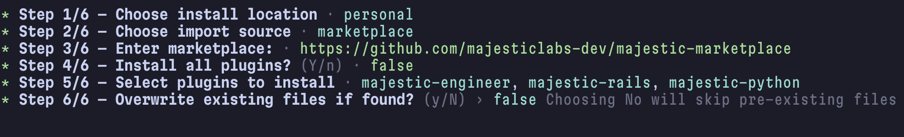
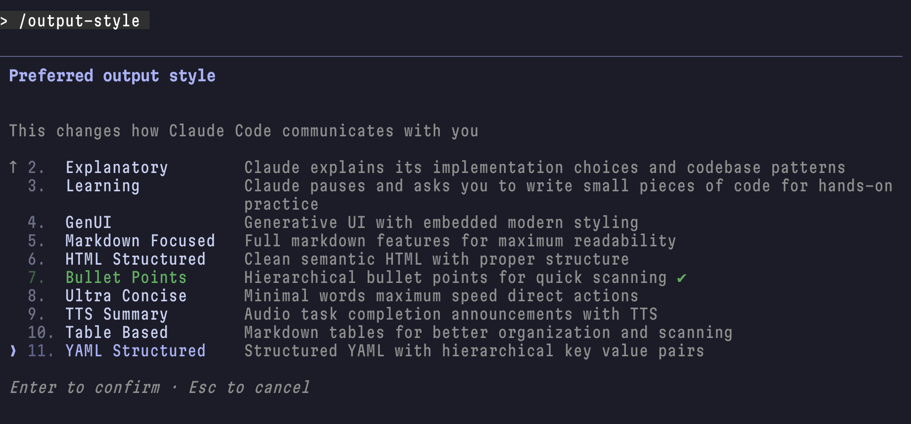

# Majestic Marketplace

The Majestic marketplace where we share our workflows.

**New here?** Check out the <a href="https://tutorial.majesticmarketplace.com" target="_blank">Marketplace Tutorial</a> for an interactive walkthrough.

## Quick Start

Run the installer:

```bash
curl -fsSL https://raw.githubusercontent.com/majesticlabs-dev/majestic-marketplace/master/install.sh | bash
```

This gives you options to:
1. Add marketplace (enables plugin installation)
2. Add output styles (formatting guides)
3. Add MCP servers (Sequential Thinking)
4. Configure shell settings (env vars + alias)
5. Install Beads (AI agent memory)
6. Install all

### Manual Installation

#### Claude Code

Run `claude` and add the marketplace:

```bash
/plugin marketplace add https://github.com/majesticlabs-dev/majestic-marketplace.git
```

Then install a plugin:

```bash
/plugin install {plugin-name}
```

#### Factory AI (Droid)

Use [droid-factory](https://github.com/iannuttall/droid-factory) to import Claude Code marketplace agents:

```bash
bunx droid-factory
```

This launches a guided installer that can import agents from Claude Code marketplaces into Factory's `.factory/droids/` directory.

**Prerequisites:** Enable Custom Droids in Factory (`/settings` → Experimental → Custom Droids)

**Note:** Skills and commands are Claude Code-specific and won't transfer directly.



## Majestic Plugins

| Plugin | Description |
|--------|-------------|
| [majestic-engineer](plugins/majestic-engineer/README.md) | Language-agnostic engineering workflows (17 agents, 8 commands, 12 skills) |
| [majestic-rails](plugins/majestic-rails/README.md) | Ruby on Rails development tools (23 agents, 5 commands, 9 skills) |
| [majestic-python](plugins/majestic-python/README.md) | Python development tools (2 agents) |
| [majestic-marketing](plugins/majestic-marketing/README.md) | Marketing and SEO tools (14 agents, 2 commands, 24 skills) |
| [majestic-sales](plugins/majestic-sales/README.md) | Sales acceleration tools (1 command, 6 skills) |
| [majestic-company](plugins/majestic-company/README.md) | Business operations and CEO tools (2 agents, 21 skills) |
| [majestic-tools](plugins/majestic-tools/README.md) | Claude Code customization tools (10 commands, 3 skills) |

## Recommended Tools

Third-party plugins that complement the Majestic suite:

| Plugin | Description | Install |
|--------|-------------|---------|
| [osgrep](https://github.com/Ryandonofrio3/osgrep) | Semantic code search with natural language queries - find code by intent, not just keywords | `npm i -g osgrep && osgrep install-claude-code` |
| [beads](https://github.com/steveyegge/beads) | Dependency-aware issue tracker - issues chained like beads with blocking relationships | `curl -fsSL https://raw.githubusercontent.com/steveyegge/beads/main/install.sh \| bash` |
| [beads_viewer](https://github.com/Dicklesworthstone/beads_viewer) | Terminal UI for Beads with DAG visualization, graph metrics, and AI agent "robot mode" | `curl -fsSL https://raw.githubusercontent.com/Dicklesworthstone/beads_viewer/main/install.sh \| bash` |

## Recommended Settings

Add Claude Code environment variables to your shell profile:

```bash
# Option 1: Use the installer (menu option 4)
curl -fsSL https://raw.githubusercontent.com/majesticlabs-dev/majestic-marketplace/master/install.sh | bash

# Option 2: Manual - append to ~/.zshrc or ~/.bashrc
curl -fsSL https://raw.githubusercontent.com/majesticlabs-dev/majestic-marketplace/master/instructions/shell-settings.sh >> ~/.zshrc
source ~/.zshrc
```

| Setting | Description |
|---------|-------------|
| `ENABLE_BACKGROUND_TASKS` | Enables background task execution |
| `FORCE_AUTO_BACKGROUND_TASKS` | Automatically runs eligible tasks in background |
| `CLAUDE_BASH_MAINTAIN_PROJECT_WORKING_DIR` | Keeps bash commands in project directory |
| `cly` alias | Launches Claude Code with auto-approve for trusted projects |

## Updating Marketplace & Plugins

### Update Everything

```bash
/plugin marketplace update majestic-marketplace
```

This pulls the latest changes from the marketplace repository and updates all installed plugins.

### Update Individual Plugin

```bash
/plugin update majestic-engineer
```

### Check Installed Versions

```bash
/plugin list
```

## Output Styles

Configure how Claude Code communicates with you using the `/output-style` command:

```bash
/output-style
```



| Style | Description |
|-------|-------------|
| Bullet Points | Hierarchical bullet points for quick scanning |
| Explanatory | Claude explains its implementation choices and codebase patterns |
| GenUI | Generative UI with embedded modern styling |
| HTML Structured | Clean semantic HTML with proper structure |
| Learning | Claude pauses and asks you to write small pieces of code for hands-on practice |
| Markdown Focused | Full markdown features for maximum readability |
| Table Based | Markdown tables for better organization and scanning |
| TTS Summary | Audio task completion announcements with TTS |
| Ultra Concise | Minimal words maximum speed direct actions |
| YAML Structured | Machine-readable YAML format for structured data and easy parsing |

See [Output Styles](output-styles/README.md) for full documentation and customization.

## Project Setup

### Initialize Project Configuration

After installing plugins, run this command in your project to set up AI agent configuration:

```bash
/majestic:init-agents-md
```

This creates:
- **AGENTS.md** - Human-readable guidance for Claude (WHAT/WHY/HOW framework)
- **.agents.yml** - Machine-readable config for commands
- **CLAUDE.md** - Symlink to AGENTS.md

### .agents.yml Config

The `.agents.yml` file stores project-specific settings that commands read automatically:

```yaml
# .agents.yml - Project configuration for Claude Code commands
default_branch: main
tech_stack: rails              # rails | python | generic
app_status: development        # development | production
task_management: github        # github | linear | beads | file | none
workflow: worktrees            # worktrees | branches
branch_naming: type/issue-desc # feature/desc | issue-desc | type/issue-desc | user/desc
review_topics_path: docs/agents/review-topics.md
```

Commands like `/majestic:code-review`, `/git:create-pr`, and `/majestic:build-task` read this config automatically.

**Custom Config Path:** Override the config filename with `AGENTS_CONFIG` environment variable:

```bash
export AGENTS_CONFIG=".my-project-config.yml"
```

### CLAUDE.md Instruction Modules

Add pre-built coding guidelines to your CLAUDE.md using the installer:

```bash
bash -c "$(curl -fsSL https://raw.githubusercontent.com/majesticlabs-dev/majestic-marketplace/master/install.sh)"
```

Available modules:
- **critical-thinking** - Challenge assumptions, prioritize accuracy over validation
- **anti-overengineering** - YAGNI, KISS, DRY - avoid unnecessary complexity
- **analyze-vs-implement** - Distinguish suggestion from action
- **investigation-first** - Understand before proposing solutions

## Resources

| Resource | Description |
|----------|-------------|
| <a href="https://tutorial.majesticmarketplace.com" target="_blank">Marketplace Tutorial</a> | Interactive slide deck for getting started |
| [Output Styles](output-styles/README.md) | Pre-built formatting guides for consistent responses |
| [Instructions](instructions/) | CLAUDE.md instruction modules |

## References

- [Antrhopic Marketplace](https://github.com/anthropics/claude-code/tree/main/plugins)
- [Every Marketplace](https://github.com/EveryInc/every-marketplace)
- [Superpowers](https://github.com/obra/superpowers)
- [Rails Development Skills](https://github.com/alec-c4/claude-skills-rails-dev)
