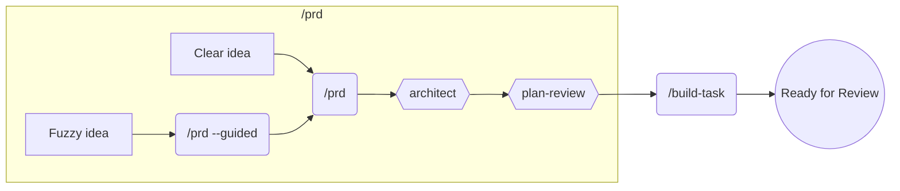
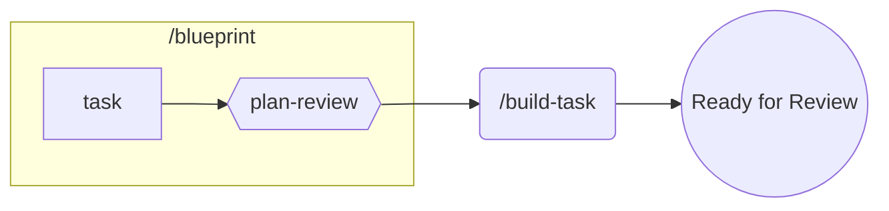
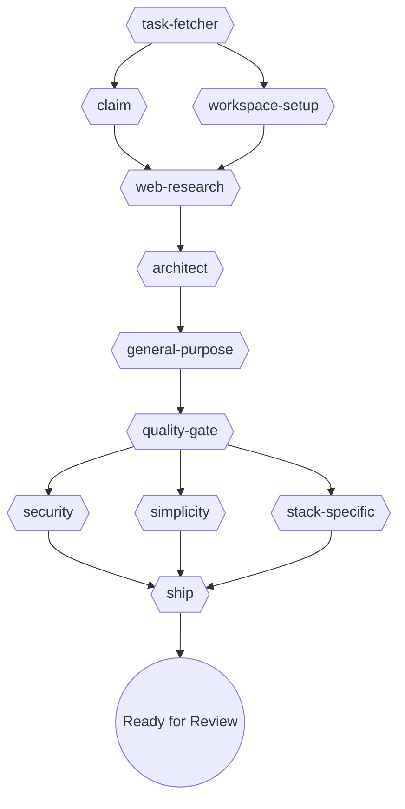

# Majestic Engineer

Language-agnostic engineering workflows. Includes 38 specialized agents, 32 commands, and 28 skills.

## Installation

```bash
claude /plugin install majestic-engineer
```

## QuickStart

After installing, initialize your project:

```bash
/majestic:init
```

This creates:
- **AGENTS.md** - Hierarchical guidance structure for your codebase
- **.agents.yml** - Machine-readable configuration for commands
- **CLAUDE.md** - Symlink to AGENTS.md (Claude Code's default)

The command auto-detects your tech stack (Rails, Python, Node, etc.) and configures workflows accordingly.

## Recommended Workflows

**Legend:** `(/command)` = user triggers | `{{agent}}` = runs automatically | `((state))` = outcome

### PRD vs Blueprint

| Aspect | `/majestic:prd` | `/majestic:blueprint` |
|--------|-----------------|----------------------|
| **Purpose** | Define WHAT to build & WHY | Define HOW to build it |
| **Output** | `docs/prd/prd-[name].md` | `docs/plans/[timestamp]_[name].md` |
| **Audience** | Stakeholders, PMs, leadership | Developers implementing the feature |
| **Focus** | Problem, users, features, metrics | Architecture, files, tasks, dependencies |

**When to use each:**

| Situation | Use |
|-----------|-----|
| New product/major feature, need stakeholder alignment | PRD first → Blueprint → build-task |
| Clear feature, just need implementation plan | Blueprint → build-task |
| Bug fix or small improvement | Blueprint → build-task |
| Fuzzy idea, need discovery | PRD with `--guided` flag |

---

### PRD-First (New Products/Features)



| When | Use | Purpose |
|------|-----|---------|
| **Clear idea** | `/majestic:prd` | Batch questions → generate PRD → architect designs → plan-review validates |
| **Fuzzy idea** | `/majestic:prd --guided` | Interactive one-at-a-time discovery → then generates PRD |

---

### Blueprint-First (Features/Bugs/Improvements)



| Command | Purpose |
|---------|---------|
| `/majestic:blueprint` | Create blueprint → plan-review validates |
| `/majestic:build-task` | Build → test → review → ship (autonomous) |

---

### Inside `/build-task`

Autonomous implementation from any task management system:

```bash
/majestic:build-task #42          # GitHub Issue
/majestic:build-task PROJ-123     # Beads task
/majestic:build-task LIN-456      # Linear issue
```

**What happens:**



| Stage | Agents | Config | Purpose |
|-------|--------|--------|---------|
| Fetch | `task-fetcher` | `task_management` | Get task from GitHub/Beads/Linear/file |
| Setup | `claim` + `workspace-setup` | `workflow`, `branch_naming` | Mark in-progress, create branch/worktree |
| Research | `web-research` | - | Find best practices and context |
| Plan | `architect` | - | Design implementation approach |
| Build | `general-purpose` | - | Implement the feature |
| Review | `quality-gate` → parallel reviewers | `tech_stack` | Security, simplicity, stack-specific |
| Ship | `ship` | - | Create PR, mark ready for review |

## Quick Reference

| I want to... | Use this |
|--------------|----------|
| Plan a feature or bug fix | `/majestic:blueprint` |
| Analyze a spec for gaps | `agent spec-reviewer` |
| Define what to build (requirements) | `/majestic:prd` |
| Design how to build it (architecture) | `agent architect` |
| Plan a refactoring effort | `agent refactor-plan` |
| Review a plan before implementing | `agent plan-review` |

## Agents

Invoke with: `agent <name>`

### Root

| Agent | Description |
|-------|-------------|
| `ci-resolver` | Resolve CI failures by fetching logs, analyzing errors, implementing fixes |
| `github-resolver` | Resolve CI failures and PR review comments (auto-detects project type) |
| `pr-comment-resolver` | Address PR review comments by implementing reviewer feedback |
| `rp-reviewer` | Code review using RepoPrompt MCP (chat_send mode=review) |
| `session-checkpoint` | Save session state to ledger file for continuity across crashes |

### design

| Agent | Description |
|-------|-------------|
| `ui-ux-designer` | Iterative UI/UX refinement through screenshots and progressive improvements |

### plan

| Agent | Description |
|-------|-------------|
| `architect` | Design non-trivial features, system architecture planning |
| `plan-review` | Thorough review of development plans before implementation |
| `refactor-plan` | Analyze code structure and create comprehensive refactoring plans |
| `spec-reviewer` | Analyze specs and plans for user flows, gaps, and missing requirements |
| `task-breakdown` | Break plans into small tasks (1-3 story points) with dependency matrix |

### qa

| Agent | Description |
|-------|-------------|
| `acceptance-criteria-verifier` | Verify acceptance criteria from a plan, task, or issue |
| `security-review` | OWASP Top 10 vulnerability scanning, secrets detection |
| `slop-remover` | Remove AI-generated code slop (over-commenting, defensive overkill) |
| `test-create` | Automated test creation across frameworks (RSpec, Minitest, Jest) |
| `test-reviewer` | Review test quality, coverage, edge cases, and assertion quality |
| `test-runner` | Run test suite and return structured results (directory, file, or test) |
| `ui-code-auditor` | Static code analysis for UI quality, accessibility, and performance |
| `visual-validator` | Verify UI changes achieved their goals through skeptical visual analysis |

### relay

| Agent | Description |
|-------|-------------|
| `blueprint-to-epics` | Split blueprint into epics by logical phase |
| `init-playlist` | Generate playlist.yml from epics folder |
| `learning-processor` | Aggregate learnings from relay epic into lessons |

### research

| Agent | Description |
|-------|-------------|
| `best-practices-researcher` | Research external best practices with structured citations |
| `docs-architect` | Create comprehensive technical documentation from codebases |
| `docs-researcher` | Fetch and summarize library documentation |
| `git-researcher` | Analyze git history, trace code evolution, identify contributor expertise |
| `repo-analyst` | Repository onboarding — structure, conventions, templates, patterns |
| `web-research` | Internet research for debugging, solutions, and technical problems |

### workflow

| Agent | Description |
|-------|-------------|
| `always-works-verifier` | Verify implementations actually work before declaring completion |
| `build-task-workflow-manager` | Orchestrate build execution: build, verify, quality, fix loop, ship |
| `context-proxy` | Wrap agent invocations with output budget enforcement |
| `lessons-discoverer` | Discover and rank relevant lessons using semantic scoring |
| `quality-gate` | Orchestrate parallel code review based on tech stack configuration |
| `ship` | Complete shipping workflow: lint, commit, PR |
| `task-fetcher` | Fetch task from configured backend (GitHub, Beads, Linear, file) |
| `task-status-updater` | Update task status (claim/ship) across backends |
| `toolbox-resolver` | Discover and resolve tech-stack toolbox manifests from plugins |
| `workspace-setup` | Create branch or worktree based on project configuration |

## Commands

Invoke with: `/majestic-engineer:<name>`

### Top-level

| Command | Description |
|---------|-------------|
| `config-reader` | Get a config value from .agents.yml (with local overrides) |
| `explain` | Explain a concept using real examples from your project |
| `favicon` | Generate complete favicon set from source image |

### git

| Command | Description |
|---------|-------------|
| `git:changelog` | Create engaging changelogs from recent merges |
| `git:code-story` | Generate documentary-style narrative of repository history |
| `git:commit` | Create git commit with proper message formatting |
| `git:create-pr` | Create a pull request for the current feature branch |
| `git:pr-review` | Review and address Pull Request comments from GitHub |
| `git:triage-prs` | Triage open PRs with parallel review, label, and merge decisions |
| `git:worktree-cleanup` | Clean up merged and stale git worktrees |

### relay

| Command | Description |
|---------|-------------|
| `relay:init` | Parse blueprint markdown into epic.yml for fresh-context execution |
| `relay:playlist-status` | Show playlist progress across all epics |
| `relay:run-playlist` | Output terminal command to execute playlist |
| `relay:status` | Show current epic progress and task status |
| `relay:work` | Execute epic tasks with fresh-context Claude instances |

### session

| Command | Description |
|---------|-------------|
| `session:handoff` | Create a detailed handoff plan for continuing work |
| `session:ledger-clear` | Clear the session ledger file to start fresh |
| `session:pickup` | Resume work from a previous handoff session |
| `session:smart-compact` | Analyze conversation and generate optimized /compact command |

### tasks

| Command | Description |
|---------|-------------|
| `tasks:new` | Manage backlog items across files, GitHub Issues, Linear, or Beads |

### workflows

| Command | Description |
|---------|-------------|
| `workflows:blueprint` | Transform feature descriptions into well-structured project blueprints |
| `workflows:build-task` | Autonomous task implementation from any task management system |
| `workflows:code-review` | Generic code review that auto-detects tech stack |
| `workflows:debug` | Debug errors, test failures, or unexpected behavior |
| `workflows:init` | Initialize AGENTS.md with hierarchical structure |
| `workflows:prd` | Create a PRD for a product/feature (`--guided` for interactive) |
| `workflows:quality-gate` | Run quality gate checks with tech stack-aware reviewers |
| `workflows:question` | Answer questions about project structure without coding |
| `workflows:refactor-agents` | Refactor existing AGENTS.md to follow progressive disclosure |
| `workflows:run-blueprint` | Execute all blueprint tasks using build-task with ralph-loop |
| `workflows:ship-it` | Complete checkout workflow: lint, commit, PR |
| `workflows:ux-brief` | Create junior-dev-ready design systems through guided discovery |

## Skills

Invoke with: `skill majestic-engineer:<name>`

| Skill | Description | Auto |
|-------|-------------|------|
| `backlog-manager` | Manage project backlogs and task prioritization | |
| `blueprint-discovery` | Discovery phase for blueprint workflow | |
| `blueprint-execution` | Execution phase for blueprint workflow | |
| `blueprint-research` | Research phase for blueprint workflow | |
| `check-ci` | Monitor PR CI checks by polling GitHub status | |
| `cloudflare-worker` | Build edge-first TypeScript apps on Cloudflare Workers | |
| `code-story` | Narrative templates for git changelog stories | |
| `config-reader` | Read project config from .agents.yml | |
| `create-adr` | Create Architecture Decision Records | |
| `design-tool-picker` | Choose the right design tool for your task | |
| `fix-decision-router` | Post-documentation routing for fix-reporter | |
| `fix-reporter` | Capture solved problems as categorized documentation | |
| `frontend-css-patterns` | Framework-agnostic CSS patterns and utilities | yes |
| `frontend-design` | Create distinctive, production-grade frontend interfaces | yes |
| `frontend-design-philosophy` | Design thinking principles for distinctive interfaces | yes |
| `git-worktree` | Manage git worktrees for parallel development | |
| `hierarchical-agents` | Generate hierarchical AGENTS.md structure | |
| `init-agents-config` | Generate .agents.yml configuration | |
| `mermaid-builder` | Create syntactically correct Mermaid diagrams | yes |
| `plan-builder` | Write implementation plans from templates | |
| `pr-screenshot-docs` | Capture and document UI changes with screenshots | |
| `readme-craft` | Production-grade README.md patterns for any project | yes |
| `relay/attempt-ledger` | Track relay task attempts and outcomes | |
| `research-compound` | Compound learnings into AGENTS.md during research | yes |
| `structured-logging` | Production logging patterns for observability | yes |
| `task-coordinator` | Orchestrate multi-step workflows with task tracking | |
| `tdd-workflow` | Test-driven development using red-green-refactor | yes |
| `technical-writer` | Write technical tutorials and educational content | yes |
| `ux-brief` | Design system templates and UX documentation | |

## Configuration

### Task Management

The `backlog-manager` skill supports multiple backends:

| Backend | Choose When |
|---------|-------------|
| **Files** | Solo/small projects, want git-tracked todos, no external dependencies |
| **GitHub** | Already using GitHub Issues, team collaboration, want PR/issue linking |
| **Linear** | Already using Linear, sprint planning, need project management features |
| **Beads** | Dependency-aware workflows, AI agent coordination, need blocking/ready tracking |

Configure in your project's CLAUDE.md:

```markdown
## Task Management
backend: github  # Options: files, github, linear, beads
```

### External Dependencies

| Tool | Required For | Installation |
|------|--------------|--------------|
| [beads](https://github.com/steveyegge/beads) | `backlog-manager` beads backend | `curl -fsSL https://raw.githubusercontent.com/steveyegge/beads/main/install.sh \| bash` |

## Usage Examples

```bash
# Create a PRD for a new feature
/majestic-engineer:workflows:prd "Mobile app for tracking fitness goals"

# Design implementation based on PRD
agent majestic-engineer:plan:architect "Design user authentication system"

# Create commit and PR
/majestic-engineer:git:commit
/majestic-engineer:git:create-pr

# Monitor CI (using skill)
skill majestic-engineer:check-ci

# Use git-worktree skill for parallel development
skill majestic-engineer:git-worktree
```
