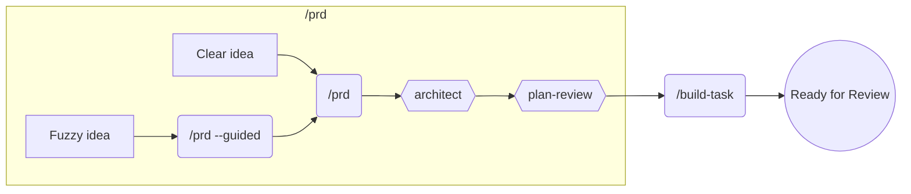
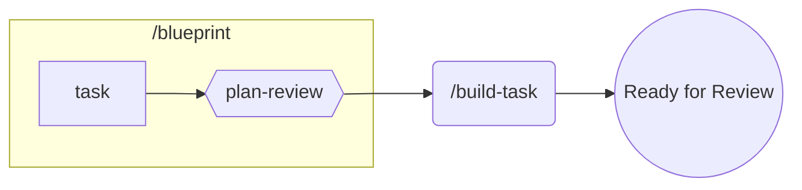
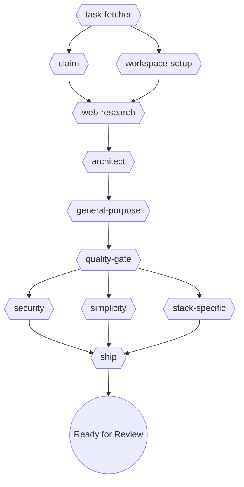

# Majestic Engineer

Language-agnostic engineering workflows. Includes 26 specialized agents, 19 commands, and 13 skills.

## Installation

```bash
claude /plugin install majestic-engineer
```

## QuickStart

After installing, initialize your project:

```bash
/majestic:init
```

This creates:
- **AGENTS.md** - Hierarchical guidance structure for your codebase
- **.agents.yml** - Machine-readable configuration for commands
- **CLAUDE.md** - Symlink to AGENTS.md (Claude Code's default)

The command auto-detects your tech stack (Rails, Python, Node, etc.) and configures workflows accordingly.

## Recommended Workflows

**Legend:** `(/command)` = user triggers | `{{agent}}` = runs automatically | `((state))` = outcome

### PRD-First (New Products/Features)



| When | Use | Purpose |
|------|-----|---------|
| **Clear idea** | `/majestic:prd` | Batch questions → generate PRD → architect designs → plan-review validates |
| **Fuzzy idea** | `/majestic:prd --guided` | Interactive one-at-a-time discovery → then generates PRD |

---

### Blueprint-First (Features/Bugs/Improvements)



| Command | Purpose |
|---------|---------|
| `/majestic:blueprint` | Create blueprint → plan-review validates |
| `/majestic:build-task` | Build → test → review → ship (autonomous) |

---

### Inside `/build-task`

Autonomous implementation from any task management system:

```bash
/majestic:build-task #42          # GitHub Issue
/majestic:build-task PROJ-123     # Beads task
/majestic:build-task LIN-456      # Linear issue
```

**What happens:**



| Stage | Agents | Config | Purpose |
|-------|--------|--------|---------|
| Fetch | `task-fetcher` | `task_management` | Get task from GitHub/Beads/Linear/file |
| Setup | `claim` + `workspace-setup` | `workflow`, `branch_naming` | Mark in-progress, create branch/worktree |
| Research | `web-research` | - | Find best practices and context |
| Plan | `architect` | - | Design implementation approach |
| Build | `general-purpose` | - | Implement the feature |
| Review | `quality-gate` → parallel reviewers | `tech_stack` | Security, simplicity, stack-specific |
| Ship | `ship` | - | Create PR, mark ready for review |

## Quick Reference

| I want to... | Use this |
|--------------|----------|
| Plan a feature or bug fix | `/majestic:blueprint` |
| Analyze a spec for gaps | `agent spec-reviewer` |
| Define what to build (requirements) | `/majestic:prd` |
| Design how to build it (architecture) | `agent architect` |
| Plan a refactoring effort | `agent refactor-plan` |
| Review a plan before implementing | `agent plan-review` |

## Agents

Invoke with: `agent <name>`

### design

| Agent | Description |
|-------|-------------|
| `ui-ux-designer` | Iterative UI/UX refinement through screenshots and progressive improvements |

### plan

| Agent | Description |
|-------|-------------|
| `architect` | Design non-trivial features, system architecture planning |
| `plan-review` | Thorough review of development plans before implementation |
| `refactor-plan` | Analyze code structure and create comprehensive refactoring plans |
| `spec-reviewer` | Analyze specs and plans for user flows, gaps, and missing requirements |

### qa

| Agent | Description |
|-------|-------------|
| `security-review` | OWASP Top 10 vulnerability scanning, secrets detection |
| `slop-remover` | Remove AI-generated code slop (over-commenting, defensive overkill, type escapes) |
| `test-create` | Automated test creation across frameworks (RSpec, Minitest, Jest) |
| `test-reviewer` | Review test quality, coverage, edge cases, and assertion quality |
| `visual-validator` | Verify UI changes achieved their goals through skeptical visual analysis |

### research

| Agent | Description |
|-------|-------------|
| `best-practices-researcher` | Research external best practices and documentation with structured citations |
| `docs-architect` | Create comprehensive technical documentation from codebases |
| `docs-researcher` | Fetch and summarize library documentation |
| `git-researcher` | Analyze git history, trace code evolution, and identify contributor expertise |
| `repo-analyst` | Repository onboarding - analyze structure, conventions, templates, and patterns |
| `web-research` | Internet research for debugging, finding solutions, and technical problems |

### review

| Agent | Description |
|-------|-------------|
| `project-topics-reviewer` | Review code against project-specific topics defined in AGENTS.md |

### workflow

| Agent | Description |
|-------|-------------|
| `always-works-verifier` | Verify implementations actually work before declaring completion |
| `github-resolver` | Resolve CI failures and PR review comments (auto-detects project type) |
| `quality-gate` | Orchestrate parallel code review based on tech stack configuration |
| `ship` | Complete shipping workflow: lint, commit, PR |
| `task-fetcher` | Fetch task from configured backend (GitHub, Beads, Linear, file) |
| `task-status-updater` | Update task status (claim/ship) across backends |
| `workspace-setup` | Create branch or worktree based on project configuration |
| `toolbox-resolver` | Discover and resolve tech-stack toolbox manifests from installed plugins |

## Commands

Invoke with: `/majestic-engineer:<category>:<name>`

### git

| Command | Description |
|---------|-------------|
| `git:changelog` | Create engaging changelogs from recent merges |
| `git:code-story` | Generate documentary-style narrative of repository development history |
| `git:commit` | Create git commit with proper message formatting |
| `git:create-pr` | Create a pull request for the current feature branch |
| `git:pr-review` | Review and address Pull Request comments from GitHub |

### session

| Command | Description |
|---------|-------------|
| `session:handoff` | Create a detailed handoff plan for continuing work |
| `session:pickup` | Resume work from a previous handoff session |

### tasks

| Command | Description |
|---------|-------------|
| `tasks:new` | Manage backlog items across files, GitHub Issues, Linear, or Beads |

### workflows

| Command | Description |
|---------|-------------|
| `workflows:run-blueprint` | Execute all tasks in a blueprint using build-task workflow with ralph-wiggum iteration |
| `workflows:build-task` | Autonomous task implementation from any task management system (GitHub, Beads, Linear, file) |
| `workflows:debug` | Debug errors, test failures, or unexpected behavior (auto-detects project type) |
| `workflows:init` | Initialize AGENTS.md with hierarchical structure and create CLAUDE.md symlink |
| `workflows:blueprint` | Transform feature descriptions into well-structured project blueprints |
| `workflows:prd` | Create a PRD for a product/feature. Use `--guided` flag for interactive discovery |
| `workflows:question` | Answer questions about project structure without coding |
| `workflows:ship-it` | Complete checkout workflow - runs linting, creates commit, and opens PR |

## Skills

Invoke with: `skill majestic-engineer:<name>`

| Skill | Description |
|-------|-------------|
| `ast-grep-searching` | Structural code search and AST-based pattern matching for safe refactoring |
| `backlog-manager` | Manage project backlogs and task prioritization |
| `check-ci` | Monitor PR CI checks by polling GitHub status |
| `cloudflare-worker` | Build edge-first TypeScript apps on Cloudflare Workers (Hono, KV, D1, R2, Durable Objects) |
| `create-adr` | Create Architecture Decision Records for significant technical decisions |
| `fix-reporter` | Capture solved problems as categorized documentation with YAML frontmatter |
| `frontend-design` | Create distinctive, production-grade frontend interfaces for Tailwind, React, Vue, and Rails/Hotwire |
| `git-worktree` | Manage git worktrees for parallel development |
| `hierarchical-agents` | Generate hierarchical AGENTS.md structure for codebases |
| `mermaid-builder` | Create syntactically correct Mermaid diagrams |
| `pr-screenshot-docs` | Capture and document UI changes with before/after screenshots for PRs |
| `ripgrep-search` | Fast, intelligent code and text searching with ripgrep |
| `subagent-driven-development` | Execute plans with fresh subagent per task and code review between tasks |
| `tdd-workflow` | Test-driven development using red-green-refactor cycle |
| `web-browser` | Browser automation via Chrome DevTools Protocol |

## Configuration

### Task Management

The `backlog-manager` skill supports multiple backends:

| Backend | Choose When |
|---------|-------------|
| **Files** | Solo/small projects, want git-tracked todos, no external dependencies |
| **GitHub** | Already using GitHub Issues, team collaboration, want PR/issue linking |
| **Linear** | Already using Linear, sprint planning, need project management features |
| **Beads** | Dependency-aware workflows, AI agent coordination, need blocking/ready tracking |

Configure in your project's CLAUDE.md:

```markdown
## Task Management
backend: github  # Options: files, github, linear, beads
```

### External Dependencies

| Tool | Required For | Installation |
|------|--------------|--------------|
| [beads](https://github.com/steveyegge/beads) | `backlog-manager` beads backend | `curl -fsSL https://raw.githubusercontent.com/steveyegge/beads/main/install.sh \| bash` |

## Usage Examples

```bash
# Create a PRD for a new feature
/majestic-engineer:workflows:prd "Mobile app for tracking fitness goals"

# Design implementation based on PRD
agent majestic-engineer:plan:architect "Design user authentication system"

# Create commit and PR
/majestic-engineer:git:commit
/majestic-engineer:git:create-pr

# Monitor CI (using skill)
skill majestic-engineer:check-ci

# Use git-worktree skill for parallel development
skill majestic-engineer:git-worktree
```
