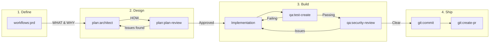

# Majestic Engineer

Language-agnostic engineering workflows. Includes 17 specialized agents, 8 commands, and 12 skills.

## Installation

```bash
claude /plugin install majestic-engineer
```

## Agents

Invoke with: `claude agent majestic-engineer:<category>:<name>`

| Agent | Description |
|-------|-------------|
| `plan:architect` | Design non-trivial features, system architecture planning |
| `plan:plan-review` | Thorough review of development plans before implementation |
| `plan:refactor-plan` | Analyze code structure and create comprehensive refactoring plans |
| `plan:spec-reviewer` | Analyze specs and plans for user flows, gaps, and missing requirements |
| `qa:security-review` | OWASP Top 10 vulnerability scanning, secrets detection |
| `qa:test-create` | Automated test creation across frameworks (RSpec, Minitest, Jest) |
| `qa:test-reviewer` | Review test quality, coverage, edge cases, and assertion quality |
| `qa:visual-validator` | Verify UI changes achieved their goals through skeptical visual analysis |
| `workflow:ship` | Complete shipping workflow: lint, commit, PR |
| `workflow:always-works-verifier` | Verify implementations actually work before declaring completion |
| `research:docs-architect` | Create comprehensive technical documentation from codebases |
| `research:docs-researcher` | Fetch and summarize library documentation |
| `research:git-researcher` | Analyze git history, trace code evolution, and identify contributor expertise |
| `research:web-research` | Internet research for debugging, finding solutions, and technical problems |
| `research:best-practices-researcher` | Research external best practices and documentation with structured citations |
| `research:repo-analyst` | Repository onboarding - analyze structure, conventions, templates, and patterns |
| `design:ui-ux-designer` | Iterative UI/UX refinement through screenshots and progressive improvements |

## Commands

Invoke with: `/majestic-engineer:<category>:<name>`

### git
| Command | Description |
|---------|-------------|
| `git:commit` | Create git commit with proper message formatting |
| `git:create-pr` | Create a pull request for the current feature branch |
| `git:pr-review` | Review and address Pull Request comments from GitHub |
| `git:changelog` | Create engaging changelogs from recent merges |

### workflows
| Command | Description |
|---------|-------------|
| `workflows:prd` | Create a Product Requirements Document (PRD) for a new product or feature |
| `workflows:question` | Answer questions about project structure without coding |

### session
| Command | Description |
|---------|-------------|
| `session:handoff` | Create a detailed handoff plan for continuing work |
| `session:pickup` | Resume work from a previous handoff session |

## Skills

Invoke with: `claude skill majestic-engineer:<name>`

| Skill | Description |
|-------|-------------|
| `ast-grep-searching` | Structural code search and AST-based pattern matching for safe refactoring |
| `backlog-manager` | Manage project backlogs and task prioritization |
| `check-ci` | Monitor PR CI checks by polling GitHub status |
| `create-adr` | Create Architecture Decision Records for significant technical decisions |
| `fix-reporter` | Capture solved problems as categorized documentation with YAML frontmatter |
| `frontend-design` | Create distinctive, production-grade frontend interfaces for Tailwind, React, Vue, and Rails/Hotwire |
| `git-worktree` | Manage git worktrees for parallel development |
| `mermaid-builder` | Create syntactically correct Mermaid diagrams |
| `ripgrep-search` | Fast, intelligent code and text searching with ripgrep |
| `subagent-driven-development` | Execute plans with fresh subagent per task and code review between tasks |
| `tdd-workflow` | Test-driven development using red-green-refactor cycle |
| `web-browser` | Browser automation via Chrome DevTools Protocol |

## When to Use What: Planning & Requirements Guide

Understanding the right tool for each stage of product development:

### Product Definition Stage

| Tool | When to Use | Output |
|------|-------------|--------|
| `/majestic-engineer:workflows:prd` | **Starting a new product/feature** - Define WHAT to build and WHY | `docs/prd/prd-[name].md` |

Use PRD when you need:
- User stories with acceptance criteria
- Success metrics and goals
- Scope boundaries (what's in/out)
- Technical considerations (high-level)

### Implementation Planning Stage

| Tool | When to Use | Output |
|------|-------------|--------|
| `agent plan:architect` | **Designing HOW to build** - Non-trivial features requiring architecture decisions | `docs/plans/[date]-[spec].md` |
| `agent plan:plan-review` | **Reviewing a plan** - Validate plans before implementation, find gaps | Review report |
| `agent plan:refactor-plan` | **Restructuring existing code** - Technical debt analysis, refactoring strategy | Refactoring plan |

### Typical Workflow



| Step | Tool | Purpose |
|------|------|---------|
| 1 | `/majestic-engineer:workflows:prd` | Define requirements (WHAT & WHY) |
| 2 | `agent plan:architect` | Design implementation (HOW) |
| 3 | `agent plan:plan-review` | Validate before coding |
| 4 | Implementation | Write the code (see note below) |
| 5 | `agent qa:test-create` | Write tests |
| 6 | `agent qa:security-review` | Security audit |
| 7 | `/majestic-engineer:git:commit` + `git:create-pr` | Ship it |

> **Note:** Implementation is technology-specific. For Rails projects, use `/majestic-rails:workflows:build` which executes plans following Rails conventions.

### Quick Reference

| I want to... | Use this |
|--------------|----------|
| Define what to build (requirements) | `/majestic-engineer:workflows:prd` |
| Design how to build it (architecture) | `agent plan:architect` |
| Review a plan before implementing | `agent plan:plan-review` |
| Plan a refactoring effort | `agent plan:refactor-plan` |
| Analyze a spec for gaps | `agent plan:spec-reviewer` |

## Task Management Configuration

The `backlog-manager` skill supports multiple task management backends. Choose based on your workflow:

| Backend | Choose When |
|---------|-------------|
| **Files** | Solo/small projects, want git-tracked todos, no external dependencies |
| **GitHub** | Already using GitHub Issues, team collaboration, want PR/issue linking |
| **Linear** | Already using Linear, sprint planning, need project management features |
| **Beads** | Dependency-aware workflows, AI agent coordination, need blocking/ready tracking |

Configure your preferred system in your project's CLAUDE.md:

### Files (Default)

No configuration needed. Items stored in `docs/todos/` as markdown files.

### GitHub Issues

```yaml
## Task Management

backend: github
github_labels: ["backlog"]
```

Requires: GitHub CLI (`gh`) installed and authenticated.

### Linear

```yaml
## Task Management

backend: linear
linear_team_id: YOUR-TEAM-ID
```

Requires: Linear MCP server configured.

### Beads

```yaml
## Task Management

backend: beads
beads_prefix: myapp  # Optional: custom issue prefix
```

Requires: beads CLI (`bd`) installed. See [External Dependencies](#external-dependencies).

### Copy to Your CLAUDE.md

**Files:**
```markdown
## Task Management
backend: files
```

**GitHub:**
```markdown
## Task Management
backend: github
github_labels: ["backlog"]
```

**Linear:**
```markdown
## Task Management
backend: linear
linear_team_id: YOUR-TEAM-ID
```

**Beads:**
```markdown
## Task Management
backend: beads
```

---

## Usage Examples

```bash
# Create a PRD for a new feature
/majestic-engineer:workflows:prd "Mobile app for tracking fitness goals"

# Design implementation based on PRD
agent majestic-engineer:plan:architect "Design user authentication system"

# Create commit and PR
/majestic-engineer:git:commit
/majestic-engineer:git:create-pr

# Monitor CI (using skill)
skill majestic-engineer:check-ci

# Use git-worktree skill for parallel development
skill majestic-engineer:git-worktree
```

## External Dependencies

Some features require external tools to be installed:

| Tool | Required For | Installation |
|------|--------------|--------------|
| [beads](https://github.com/steveyegge/beads) | `backlog-manager` beads backend | `curl -fsSL https://raw.githubusercontent.com/steveyegge/beads/main/install.sh \| bash` |
