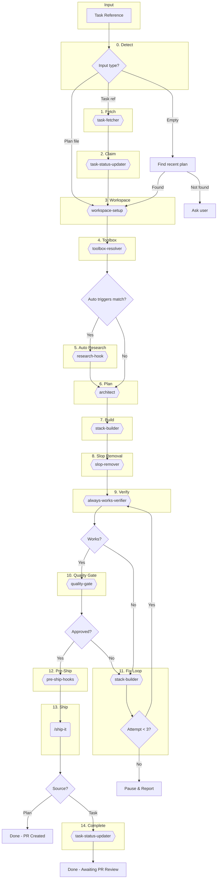

# Build Task

Autonomously implement a task through the full development lifecycle.

## Arguments

<task_reference> $ARGUMENTS </task_reference>

**Accepted formats:**
- `#123` or `123` - Issue/task number (GitHub, Linear)
- `https://github.com/owner/repo/issues/123` - GitHub URL
- `PROJ-123` - Beads or Linear ID
- `docs/plans/*.md` - Plan file from `/majestic:plan`
- *(empty)* - Auto-detect most recent plan in `docs/plans/`

## Step 0: Detect Input Type

**Before proceeding, determine the input type:**

### Case A: Empty Input (Auto-detect Plan)

If `<task_reference>` is empty:

```bash
# Find most recent plan file
ls -t docs/plans/*.md 2>/dev/null | head -1
```

- **If found:** Use that file path, proceed as Plan File (Case B)
- **If not found:** Ask user: "No recent plan found. Please provide a task reference (#123, PROJ-123, or plan file path)."

### Case B: Plan File (`docs/plans/*.md` or `*.md` path)

If input matches `docs/plans/*.md` or ends with `.md`:

1. Read the plan file
2. Extract title from first `# ` heading or filename
3. **Skip Steps 1-2** (no task to fetch/claim)
4. **Proceed to Step 3** (Workspace) with:
   - `TASK_ID`: filename slug (e.g., `add-user-auth`)
   - `TITLE`: extracted title
   - `DESCRIPTION`: full plan content
   - `TYPE`: `feature` (default for plans)
   - `SOURCE`: `plan`

### Case C: Task Reference (`#123`, `PROJ-123`, URL)

If input looks like a task reference:
- **Proceed to Step 1** (Fetch Task) normally

---

## Workflow Overview



**Legend:** `{{ }}` = Agents | `( )` = Commands | `{ }` = Decisions | `stack-builder` = Toolbox executor (rails-coder, python-coder, etc.)

---

## Step 1: Fetch Task

**Skip this step if source is `plan`.**

```
Task (majestic-engineer:workflow:task-fetcher):
  prompt: |
    Task: $ARGUMENTS
```

The agent reads `task_management` from `.agents.yml` and fetches from the appropriate backend (GitHub, Beads, Linear, or file).

**Returns:** Task ID, title, description, type, labels, status.

**Create TodoWrite** with high-level steps based on task content.

---

## Step 2: Claim Task

**Skip this step if source is `plan`.**

```
Task (majestic-engineer:workflow:task-status-updater):
  prompt: |
    Action: claim
    Task: <TASK_ID>
```

Marks task as "in progress" in the configured backend.

---

## Step 3: Set Terminal Title

Run this Bash command to set the terminal title:

```bash
printf '\033]0;🔨 #<TASK_ID>: <title-truncated-to-40-chars>\007'
```

Replace `<TASK_ID>` and `<title-truncated-to-40-chars>` with actual values from Step 1.

---

## Step 4: Setup Workspace

```
Task (majestic-engineer:workflow:workspace-setup):
  prompt: |
    Task ID: <TASK_ID>
    Title: <title>
    Type: <type from task-fetcher>
```

The agent reads `workflow` and `branch_naming` from `.agents.yml` and creates the appropriate workspace (worktree or branch).

**Returns:** Branch name, workspace path.

---

## Step 5: Resolve Toolbox Configuration

```
Task (majestic-engineer:workflow:toolbox-resolver):
  prompt: |
    Stage: build-task
    Tech Stack: <tech_stack from .agents.yml>
    Task Title: <title>
    Task Description: <description>
```

The agent discovers stack-specific toolbox manifests and returns merged configuration:
- `build_task.executor.build_agent` - Agent for build step
- `build_task.executor.fix_agent` - Agent for fix loop
- `build_task.research_hooks[]` - Available research hooks (auto + manual)
- `build_task.pre_ship_hooks[]` - Pre-ship pipeline steps

**Store the `<TOOLBOX>` config** for use in subsequent steps.

**If no manifest found:** Returns empty config, use `general-purpose` as fallback.

---

## Step 6: Auto Research (Toolbox-Triggered)

**Run BEFORE planning.** Check if any `mode: auto` research hooks match the task.

For each hook in `<TOOLBOX>.build_task.research_hooks` where `mode: auto`:

1. Check if task title or description matches any `triggers`:
   - `any_substring`: Match if ANY substring found
   - `all_substring`: Match if ALL substrings found
   - `regex`: Match if regex pattern matches

2. If triggers match, invoke the research agent:

```
Task (<hook.agent>):
  prompt: |
    Research for: <task title>
    Context: <relevant description excerpts>

    Task type: <type from task-fetcher>
```

**Store research output** for use in architect step.

**Note:** This is automatic based on triggers, not conditional on description keywords.

---

## Step 7: Plan Implementation

**If source is `plan`:** Skip this step - the plan file IS the implementation plan. Use its content directly for Step 8.

**If source is task reference:**

```
Task (majestic-engineer:plan:architect):
  prompt: |
    Create implementation plan:

    ## Task
    Title: <title>
    Description: <description>

    ## Toolbox Configuration
    Tech Stack: <tech_stack>
    Build Agent: <TOOLBOX.build_task.executor.build_agent or "general-purpose">

    ## Research Output (if auto hooks ran)
    <research findings from Step 6, or "No auto research triggered">

    ## Manual Research Hooks Available
    <list mode:manual hooks from TOOLBOX with descriptions>

    ## Requirements
    - Step-by-step implementation plan
    - Files to create/modify
    - Dependencies/prerequisites
    - Test strategy

    If you need additional research (e.g., gem evaluation), invoke the appropriate manual hook.

    Return structured, executable plan.
```

**Update TodoWrite** with specific tasks from the plan.

---

## Step 8: Build Implementation

Use the executor from toolbox configuration, falling back to `general-purpose` if not set.

```
Task (<TOOLBOX.build_task.executor.build_agent or "general-purpose">):
  prompt: |
    Implement this task:

    ## Task
    Title: <title>
    Description: <description>

    ## Plan
    <architect output OR plan file content if source is "plan">

    ## Toolbox Context
    Tech Stack: <tech_stack>
    Research Findings: <from Step 6, if any>

    ## Instructions
    1. Follow the plan step-by-step
    2. Write tests alongside implementation
    3. Commit with clear messages
    4. Report: files changed, tests written, blockers

    Work autonomously until complete.
```

**Note:** For Rails projects, this invokes `majestic-rails:rails-coder`. For Python, `majestic-python:python-coder`.

---

## Step 9: Remove AI Slop

```
Task (majestic-engineer:qa:slop-remover):
  prompt: |
    Clean up AI-generated patterns from the current branch.
```

Removes over-commenting, defensive overkill, type escape hatches, and style inconsistencies before code review.

---

## Step 10: Verify Implementation

```
Task (majestic-engineer:workflow:always-works-verifier):
  prompt: |
    Verify the implementation works.
    Branch: <branch-name>
```

The agent:
1. Reads `tech_stack` from `.agents.yml`
2. Runs build/compile checks
3. Executes relevant tests
4. Verifies the changed behavior

**Returns:** Verification report with confidence level.

**If verification fails:** → Fix Loop (Step 12)
**If verification passes:** → Quality Gate (Step 11)

---

## Step 11: Quality Gate

```
Task (majestic-engineer:workflow:quality-gate):
  prompt: |
    Context: <task title>
    Branch: <branch-name>
```

The agent reads toolbox configuration and uses `quality_gate.reviewers` if available, otherwise falls back to tech_stack-based defaults.

**Reviewer precedence:**
1. `.agents.yml quality_gate.reviewers` → Complete override
2. Toolbox `quality_gate.reviewers` → Stack-specific default
3. Hardcoded tech_stack defaults → Fallback

**Returns:** `APPROVED`, `NEEDS CHANGES` (with findings), or `BLOCKED`

---

## Step 12: Fix Loop

**Triggered when:**
- Verification fails (Step 10)
- Quality gate returns NEEDS CHANGES (Step 11)

Use the fix_agent from toolbox configuration:

```
Task (<TOOLBOX.build_task.executor.fix_agent or "general-purpose">):
  prompt: |
    Fix these issues:

    ## Findings
    <verification failures OR quality-gate findings>

    ## Toolbox Context
    Tech Stack: <tech_stack>

    ## Instructions
    1. Address each finding by severity (CRITICAL → HIGH → MEDIUM)
    2. Run tests to verify fixes
    3. Commit the fixes
    4. Report what you fixed
```

**Re-run Step 10 (Verify)** → then Step 11 (Quality Gate) if verification passes.

**Limits:** Max 3 iterations. After 3 failures → pause and report to user.

---

## Step 13: Pre-Ship Hooks

**Run after quality-gate APPROVED, before shipping.**

For each hook in `<TOOLBOX>.build_task.pre_ship_hooks`:

```
Task (<hook.agent>):
  prompt: |
    Run pre-ship checks on current branch.
    Branch: <branch-name>
```

**If `required: true` hook fails:** Pause and report to user.
**If `required: false` hook fails:** Log warning but continue.

---

## Step 14: Ship

**Once pre-ship hooks pass:**

```
SlashCommand: /majestic-engineer:workflows:ship-it
```

---

## Step 15: Mark Ready for Review

**Skip this step if source is `plan`.**

```
Task (majestic-engineer:workflow:task-status-updater):
  prompt: |
    Action: ship
    Task: <TASK_ID>
    PR: <PR_NUMBER>
```

The agent:
1. Checks CI status (waits for completion)
2. If CI fails → reports BLOCKED, stops
3. If CI passes → updates task to "ready-for-review"

**Note:** Issue remains open until PR is merged.

---

## Output Summary

### For Task References

```
## Build Task Complete

**Task:** #<ID> - <title>
**Backend:** <github|beads|linear|file>
**Status:** Ready for Review

### Toolbox Configuration
- Tech Stack: <rails|python|node|generic>
- Build Agent: <toolbox executor or general-purpose>
- Auto Research: [Triggered | Skipped]

### Workflow Summary
- Workspace: `<branch>` [worktree | branch]
- Research: [Auto-triggered | Manual | Skipped]
- Plan: [X steps]
- Build: [X files, X tests]
- Pre-Ship Hooks: [Passed | Warnings]
- Quality: [Passed on attempt X]
- Ship: PR #<NUMBER>, CI passed

### Files Changed
- `path/to/file` - [description]

### PR Link
<PR URL>

### Next Steps
- PR awaits human review
- Task closes when PR merges
```

### For Plan Files

```
## Build from Plan Complete

**Plan:** <plan-file-path>
**Title:** <title from plan>
**Source:** Local plan file

### Toolbox Configuration
- Tech Stack: <rails|python|node|generic>
- Build Agent: <toolbox executor or general-purpose>
- Auto Research: [Triggered | Skipped]

### Workflow Summary
- Workspace: `<branch>` [worktree | branch]
- Build: [X files, X tests]
- Pre-Ship Hooks: [Passed | Warnings]
- Quality: [Passed on attempt X]
- Ship: PR #<NUMBER>, CI passed

### Files Changed
- `path/to/file` - [description]

### PR Link
<PR URL>

### Next Steps
- PR awaits human review
```

---

## Error Handling

| Scenario | Action |
|----------|--------|
| Task not found | Report error, exit |
| Backend not configured | Default to `github` |
| No toolbox manifest | Use `general-purpose`, continue |
| Auto research fails | Continue without, note in summary |
| Build fails | Attempt fix with fix_agent, max 3 retries, pause |
| Pre-ship hook fails (required) | Pause, report to user |
| Pre-ship hook fails (optional) | Log warning, continue |
| Quality blocked 3× | Pause, report to user |
| Ship/CI fails | Use github-resolver to fix |

---

## Example Usage

```bash
# Auto-detect most recent plan (after running /majestic:plan)
/majestic:build-task

# Explicit plan file
/majestic:build-task docs/plans/add-user-auth.md

# GitHub issue
/majestic:build-task #42

# Beads task
/majestic:build-task PROJ-123

# Linear issue
/majestic:build-task LIN-456

# File task (legacy format)
/majestic:build-task docs/tasks/feature-x.md
```
