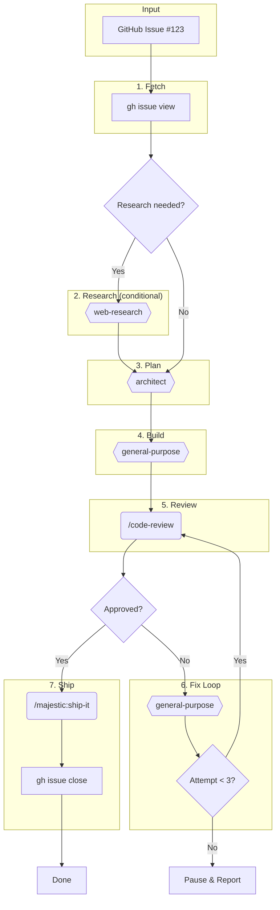

# Build Task

Autonomously implement a task from a GitHub Issue through the full development lifecycle.

## Arguments

<task_reference> $ARGUMENTS </task_reference>

**Accepted formats:**
- `#123` - Issue number
- `123` - Issue number (bare)
- `https://github.com/owner/repo/issues/123` - Full URL

## Workflow Overview



**Legend:**
- `[ ]` Bash/CLI commands
- `{{ }}` Agents (Task tool)
- `( )` Slash commands
- `{ }` Decision points

## Step 1: Fetch & Parse Issue

```bash
# Extract issue number from input
# If URL: parse out the number
# If #123 or 123: use directly

gh issue view <NUMBER> --json title,body,labels,assignees,milestone
```

**Create TodoWrite** with high-level steps based on issue content.

## Step 2: Research (Conditional)

**Trigger research if issue body contains:**
- "research", "investigate", "best practice", "how to"
- Links to external documentation
- Questions about approach
- New library/framework mentions

**If triggered:**
```
Task (majestic-engineer:research:web-research):
  prompt: |
    Research the following for implementation:

    Issue: [title]
    Context: [relevant body excerpts]

    Find:
    - Best practices for this approach
    - Common pitfalls to avoid
    - Example implementations
    - Relevant documentation

    Return concise, actionable findings.
```

## Step 3: Plan Implementation

```
Task (majestic-engineer:plan:architect):
  prompt: |
    Create an implementation plan for this GitHub Issue:

    ## Issue
    Title: [title]
    Body: [body]

    ## Research Findings (if any)
    [research output]

    ## Requirements
    - Create a clear, step-by-step implementation plan
    - Identify files to create/modify
    - Note any dependencies or prerequisites
    - Include test strategy

    Return a structured plan I can execute.
```

**Update TodoWrite** with specific implementation tasks from the plan.

## Step 4: Build Implementation

```
Task (general-purpose):
  prompt: |
    Implement this task following the plan below.

    ## GitHub Issue
    Title: [title]
    Body: [body]

    ## Implementation Plan
    [architect output]

    ## Instructions
    1. Follow the plan step-by-step
    2. Write tests alongside implementation
    3. Commit your work with clear messages
    4. Report back: files changed, tests written, any blockers

    Work autonomously until complete.
```

## Step 5: Code Review

**Detect project type and select reviewer:**

| Project Type | Detection | Review Command/Agent |
|--------------|-----------|---------------------|
| Rails | `Gemfile` with `rails` | `/majestic-rails:workflows:code-review --branch` |
| Ruby | `Gemfile` (no rails) | `majestic-rails:review:pragmatic-rails-reviewer` |
| Python | `pyproject.toml` or `requirements.txt` | `majestic-python:python-reviewer` |
| Other | Default | `majestic-engineer:review:simplicity-reviewer` |

**For Rails projects:**
```
SlashCommand: /majestic-rails:workflows:code-review --branch
```

**For other projects:**
```
Task (appropriate-reviewer):
  prompt: |
    Review the changes on this branch for:
    - Code quality and conventions
    - Test coverage
    - Potential issues

    Context: Implementing [issue title]

    Return: APPROVED, NEEDS CHANGES (with specific fixes), or BLOCKED (with blockers)
```

## Step 6: Fix Review Feedback (Loop)

**If review returns NEEDS CHANGES or BLOCKED:**

```
Task (general-purpose):
  prompt: |
    Fix these code review issues:

    ## Review Feedback
    [review output with specific issues]

    ## Instructions
    1. Address each issue listed
    2. Run tests to verify fixes
    3. Commit the fixes
    4. Report what you fixed
```

**Re-run Step 5 (Code Review)**

**Loop limits:**
- Max 3 iterations
- After 3 failures: pause and report to user

## Step 7: Ship

**Once review passes (APPROVED):**

```
SlashCommand: /majestic-engineer:workflows:ship-it
```

**After PR is created, close the issue:**

```bash
gh issue close <NUMBER> --comment "Implemented in PR #<PR_NUMBER>"
```

## Output Summary

After completion, provide:

```
## Build Task Complete

**Issue:** #123 - [title]
**Status:** Shipped

### Workflow Summary
- Research: [Skipped | Completed - key findings]
- Plan: [X steps identified]
- Build: [X files changed, X tests added]
- Review: [Passed on attempt X]
- Ship: PR #456 created, issue closed

### Files Changed
- `path/to/file.rb` - [description]
- `spec/path/to_spec.rb` - [tests added]

### PR Link
https://github.com/owner/repo/pull/456
```

## Error Handling

| Scenario | Action |
|----------|--------|
| Issue not found | Report error, exit |
| Research fails | Continue without research, note in summary |
| Build fails (tests don't pass) | Attempt fix, max 2 retries, then pause |
| Review blocked 3 times | Pause, report issues to user |
| Ship fails (lint/CI) | Use github-resolver agent to fix |

## Example Usage

```bash
# By issue number
/majestic:build-task #42

# By URL
/majestic:build-task https://github.com/myorg/myrepo/issues/42

# Bare number
/majestic:build-task 42
```
