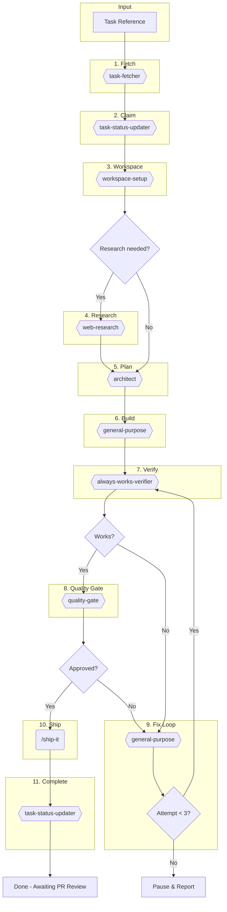

# Build Task

Autonomously implement a task through the full development lifecycle.

## Arguments

<task_reference> $ARGUMENTS </task_reference>

**Accepted formats (based on `task_management` in `.agents.yml`):**
- `#123` or `123` - Issue/task number
- `https://github.com/owner/repo/issues/123` - GitHub URL
- `PROJ-123` - Beads or Linear ID
- `path/to/task.md` - File path

## Workflow Overview



**Legend:** `{{ }}` = Agents | `( )` = Commands | `{ }` = Decisions

---

## Step 1: Fetch Task

```
Task (majestic-engineer:workflow:task-fetcher):
  prompt: |
    Task: $ARGUMENTS
```

The agent reads `task_management` from `.agents.yml` and fetches from the appropriate backend (GitHub, Beads, Linear, or file).

**Returns:** Task ID, title, description, type, labels, status.

**Create TodoWrite** with high-level steps based on task content.

---

## Step 2: Claim Task

```
Task (majestic-engineer:workflow:task-status-updater):
  prompt: |
    Action: claim
    Task: <TASK_ID>
```

Marks task as "in progress" in the configured backend.

---

## Step 3: Set Terminal Title

```
Skill: majestic-tools:set-title
Title: "🔨 #<TASK_ID>: <title-truncated-to-40-chars>"
```

---

## Step 4: Setup Workspace

```
Task (majestic-engineer:workflow:workspace-setup):
  prompt: |
    Task ID: <TASK_ID>
    Title: <title>
    Type: <type from task-fetcher>
```

The agent reads `workflow` and `branch_naming` from `.agents.yml` and creates the appropriate workspace (worktree or branch).

**Returns:** Branch name, workspace path.

---

## Step 5: Research (Conditional)

**Trigger if task description contains:**
- "research", "investigate", "best practice", "how to"
- Links to external documentation
- Questions about approach
- New library/framework mentions

```
Task (majestic-engineer:research:web-research):
  prompt: |
    Research for implementation:

    Task: <title>
    Context: <relevant description excerpts>

    Find:
    - Best practices
    - Common pitfalls
    - Example implementations
    - Relevant documentation

    Return concise, actionable findings.
```

---

## Step 6: Plan Implementation

```
Task (majestic-engineer:plan:architect):
  prompt: |
    Create implementation plan:

    ## Task
    Title: <title>
    Description: <description>

    ## Research Findings (if any)
    <research output>

    ## Requirements
    - Step-by-step implementation plan
    - Files to create/modify
    - Dependencies/prerequisites
    - Test strategy

    Return structured, executable plan.
```

**Update TodoWrite** with specific tasks from the plan.

---

## Step 7: Build Implementation

```
Task (general-purpose):
  prompt: |
    Implement this task:

    ## Task
    Title: <title>
    Description: <description>

    ## Plan
    <architect output>

    ## Instructions
    1. Follow the plan step-by-step
    2. Write tests alongside implementation
    3. Commit with clear messages
    4. Report: files changed, tests written, blockers

    Work autonomously until complete.
```

---

## Step 8: Remove AI Slop

```
Task (majestic-engineer:qa:slop-remover):
  prompt: |
    Clean up AI-generated patterns from the current branch.
```

Removes over-commenting, defensive overkill, type escape hatches, and style inconsistencies before code review.

---

## Step 9: Verify Implementation

```
Task (majestic-engineer:workflow:always-works-verifier):
  prompt: |
    Verify the implementation works.
    Branch: <branch-name>
```

The agent:
1. Reads `tech_stack` from `.agents.yml`
2. Runs build/compile checks
3. Executes relevant tests
4. Verifies the changed behavior

**Returns:** Verification report with confidence level.

**If verification fails:** → Fix Loop (Step 11)
**If verification passes:** → Quality Gate (Step 10)

---

## Step 10: Quality Gate

```
Task (majestic-engineer:workflow:quality-gate):
  prompt: |
    Context: <task title>
    Branch: <branch-name>
```

The agent reads `tech_stack` from `.agents.yml` and launches appropriate reviewers **in parallel**:

| Tech Stack | Reviewers |
|------------|-----------|
| `rails` | pragmatic-rails-reviewer, security-review, performance-reviewer, project-topics |
| `python` | python-reviewer, security-review, project-topics |
| `node` | simplicity-reviewer, security-review, project-topics |
| `generic` | simplicity-reviewer, security-review |

**Returns:** `APPROVED`, `NEEDS CHANGES` (with findings), or `BLOCKED`

---

## Step 11: Fix Loop

**Triggered when:**
- Verification fails (Step 9)
- Quality gate returns NEEDS CHANGES (Step 10)

```
Task (general-purpose):
  prompt: |
    Fix these issues:

    ## Findings
    <verification failures OR quality-gate findings>

    ## Instructions
    1. Address each finding by severity (CRITICAL → HIGH → MEDIUM)
    2. Run tests to verify fixes
    3. Commit the fixes
    4. Report what you fixed
```

**Re-run Step 9 (Verify)** → then Step 10 (Quality Gate) if verification passes.

**Limits:** Max 3 iterations. After 3 failures → pause and report to user.

---

## Step 12: Ship

**Once quality-gate returns APPROVED:**

```
SlashCommand: /majestic-engineer:workflows:ship-it
```

---

## Step 13: Mark Ready for Review

```
Task (majestic-engineer:workflow:task-status-updater):
  prompt: |
    Action: ship
    Task: <TASK_ID>
    PR: <PR_NUMBER>
```

The agent:
1. Checks CI status (waits for completion)
2. If CI fails → reports BLOCKED, stops
3. If CI passes → updates task to "ready-for-review"

**Note:** Issue remains open until PR is merged.

---

## Output Summary

```
## Build Task Complete

**Task:** #<ID> - <title>
**Backend:** <github|beads|linear|file>
**Status:** Ready for Review

### Workflow Summary
- Workspace: `<branch>` [worktree | branch]
- Research: [Skipped | Completed]
- Plan: [X steps]
- Build: [X files, X tests]
- Quality: [Passed on attempt X]
- Ship: PR #<NUMBER>, CI passed

### Files Changed
- `path/to/file` - [description]

### PR Link
<PR URL>

### Next Steps
- PR awaits human review
- Task closes when PR merges
```

---

## Error Handling

| Scenario | Action |
|----------|--------|
| Task not found | Report error, exit |
| Backend not configured | Default to `github` |
| Research fails | Continue without, note in summary |
| Build fails | Attempt fix, max 2 retries, pause |
| Quality blocked 3× | Pause, report to user |
| Ship/CI fails | Use github-resolver to fix |

---

## Example Usage

```bash
# GitHub issue
/majestic:build-task #42

# Beads task
/majestic:build-task PROJ-123

# Linear issue
/majestic:build-task LIN-456

# File task
/majestic:build-task docs/tasks/feature-x.md
```
