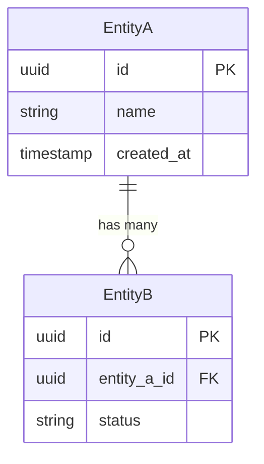

# Create a Product Requirements Document (PRD)

Generate a comprehensive PRD that defines WHAT to build and WHY, with clear user stories, acceptance criteria, and success metrics.

## Arguments

<raw_arguments>
$ARGUMENTS
</raw_arguments>

**Parse arguments:**
- If arguments start with `--guided`: Enable guided discovery mode (interactive one-question-at-a-time)
- Otherwise: Use default mode (batch 3-5 questions upfront)

Extract the product description by removing the `--guided` flag if present.

---

## Phase 0: Context Gathering (Guided Mode Only)

**Skip this phase if NOT using `--guided` mode.**

Before asking questions in guided mode, understand the project context:

1. Check for README.md, CLAUDE.md, or docs/ directory
2. Look at recent commits or changes
3. Identify the tech stack and domain

Use this context to tailor questions and skip obvious ones.

---

## Phase 1: Clarifying Questions

### Default Mode (No --guided flag)

Before generating the PRD, use `AskUserQuestion` to ask 3-5 essential clarifying questions **in a single batch**.

<thinking>
Analyze the product description to identify gaps in understanding. Focus on questions that would significantly impact the PRD's clarity. Only ask questions when the answer isn't reasonably inferable from the description.
</thinking>

**Example question format:**

```
1. What is the primary problem this solves?
   - [Specific problem option]
   - [Another problem option]
   - [Third option]

2. Who is the primary user?
   - [User type option]
   - [Another user type]
   - [Third option]
```

**Question areas to consider (pick 3-5 most critical):**

- **Problem/Goal**: What problem does this solve? What's the primary outcome?
- **Target Users**: Who will use this? What are their technical levels?
- **MVP Boundaries**: What's the absolute minimum to ship? What can wait for later?
- **Success Criteria**: How will we measure success? What metrics matter?
- **Technical Context**: Any existing systems to integrate with? Constraints?

Use `AskUserQuestion` with multiple questions (up to 4) and provide clear options for each. The tool automatically includes an "Other" option for custom responses.

**IMPORTANT:** Wait for user responses before proceeding to Phase 2.

### Guided Mode (--guided flag)

**Use this mode when `--guided` flag is provided.**

Ask questions **ONE AT A TIME**, not batched. This allows deeper exploration of each topic.

**Question areas to cover (skip any answered by context):**

1. **Problem/Opportunity**
   - What problem are you solving?
   - Who experiences this problem?
   - How painful is it currently?

2. **Solution Concept**
   - How does your product/feature solve this?
   - What's the core insight or approach?

3. **Target Users**
   - Who specifically will use this? (roles, personas)
   - What's their technical level?
   - How do they currently solve this problem?

4. **Core Capabilities**
   - What are the 3-5 must-have features?
   - What explicitly is NOT included in v1?

5. **Success Criteria**
   - How will you know it's working?
   - What metrics matter?
   - What does "done" look like?

6. **Constraints**
   - Technical constraints (stack, integrations)?
   - Time or resource constraints?
   - Dependencies on other work?

**Guided mode guidelines:**

- **ONE question per turn** - never batch questions
- **Multiple choice preferred** - when options are bounded, offer 3-4 choices
- **Skip obvious questions** - if context already answered, move on
- **Summarize every 2-3 questions** - confirm understanding before continuing
- **Adapt based on answers** - follow interesting threads, skip irrelevant areas

**Example guided question format:**

```
**What type of product is this?**
- New standalone application
- Feature for existing product
- Internal tool
- API/service
```

**After sufficient information gathered:**

1. **Synthesize** what you've learned:
   - Problem statement (1-2 sentences)
   - Target users (who, technical level)
   - Core solution (what it does)
   - Must-have features (3-5 bullets)
   - Success criteria (measurable)
   - Key constraints

2. **Present** a refined product description (2-3 paragraphs)

3. **Confirm** with user before proceeding to PRD generation

---

## Phase 2: Generate Balanced PRD

After receiving answers, generate the PRD using this structure:

### PRD Template

```markdown
# PRD: [Feature/Product Name]

## 1. Overview

- **Version**: 1.0
- **Date**: [Today's date]
- **Author**: [User or team name if known]
- **Status**: Draft

### Problem Statement

[2-3 paragraphs describing the problem, who experiences it, and why it matters]

### Target Users

[Brief description of primary users and their context]

---

## 2. Goals & Non-Goals

### Business Goals

- [Goal 1]
- [Goal 2]
- [Goal 3]

### User Goals

- [What users want to achieve]
- [Pain points being addressed]

### Non-Goals (Out of Scope)

- [Explicit boundary 1] - *Rationale: [why excluded]*
- [Explicit boundary 2] - *Rationale: [why excluded]*

---

## 3. User Personas

### Key User Types

- **[Persona Name]**: [Brief description, needs, technical level]
- **[Persona Name]**: [Brief description, needs, technical level]

### Role-Based Access

| Role | Permissions | Key Actions |
|------|-------------|-------------|
| [Role] | [Access level] | [What they can do] |

---

## 4. User Stories

### US-001: [Story Title]

- **As a** [role]
- **I want** [capability]
- **So that** [value/benefit]

**Acceptance Criteria:**
- [ ] [Specific, testable criterion]
- [ ] [Another criterion]
- [ ] [Edge case handling]

### US-002: [Story Title]

[Continue pattern for all user stories...]

**Include for each feature area:**
- At least 1 happy path scenario
- At least 1 edge case or error scenario

---

## 5. Feature Prioritization (MoSCoW)

### Must Have (MVP Critical)

| ID | Feature | Description | Acceptance Criteria |
|----|---------|-------------|---------------------|
| FR-001 | [Name] | [What it does] | [How to verify] |

### Should Have (Important)

| ID | Feature | Description | Acceptance Criteria |
|----|---------|-------------|---------------------|
| FR-002 | [Name] | [What it does] | [How to verify] |

### Could Have (Nice-to-Have)

| ID | Feature | Description | Acceptance Criteria |
|----|---------|-------------|---------------------|
| FR-003 | [Name] | [What it does] | [How to verify] |

### Won't Have (Out of Scope)

- [Feature] - *Rationale: [why excluded from this version]*

---

## 6. User Experience

### Entry Points & First-Time Flow

1. [How users discover/access the feature]
2. [First-time user experience]
3. [Onboarding considerations]

### Core Experience

| Step | Action | System Response | Success State |
|------|--------|-----------------|---------------|
| 1 | [User action] | [What happens] | [Expected outcome] |
| 2 | [User action] | [What happens] | [Expected outcome] |

### Edge Cases & Error States

- **[Scenario]**: [How it's handled]
- **[Error condition]**: [User feedback and recovery path]

### Pages & Screens *(UI products only)*

| Page | Purpose | Key Components |
|------|---------|----------------|
| [Landing] | [Convert visitors] | [Hero, features, CTA] |
| [Dashboard] | [Main workspace] | [Nav, metrics, actions] |
| [Settings] | [User configuration] | [Profile, preferences] |

*Omit this section for APIs, CLIs, or backend services.*

---

## 7. Technical Considerations

### Integration Points

- [System/API to integrate with]
- [Data sources]

### Data Storage & Privacy

- [What data is stored]
- [Privacy considerations]
- [Retention requirements]

### Performance Requirements

- [Response time expectations]
- [Scale considerations]

### Potential Challenges

- [Technical challenge 1]
- [Technical challenge 2]

---

## 8. Success Metrics

### User-Centric Metrics

- [Metric]: [Target] - *How measured*
- [Metric]: [Target] - *How measured*

### Technical Metrics

- [Metric]: [Target] - *How measured*

---

## 9. Milestones

### MVP Scope

Based on Must Have requirements:
- [List of Must Have features forming MVP]

### Phase 1: MVP

**Complexity**: [Small/Medium/Large]

- [ ] [Must Have deliverable]
- [ ] [Must Have deliverable]

### Phase 2: Enhancement

**Complexity**: [Small/Medium/Large]

- [ ] [Should Have deliverable]
- [ ] [Could Have deliverable]

---

## 10. Open Questions

- [ ] [Question needing stakeholder input]
- [ ] [Unresolved decision]
```

---

## Phase 3: Review & Expansion Offer

After generating the balanced PRD:

1. **Save the file** to `docs/prd/prd-[feature-name].md`

2. **Auto-Preview Check (REQUIRED)**

   **BEFORE presenting options, you MUST:**

   1. Invoke `config-reader` agent to get merged config (base + local overrides)
   2. Check the returned config for `auto_preview: true`
   3. **If auto_preview is true:**
      - Execute: `open docs/prd/prd-[feature-name].md`
      - Tell user: "Opened PRD in your editor."
      - Use the "auto-previewed" options below
   4. **If false or not found:** Use the "not auto-previewed" options below

3. **Present summary** of what was created

4. Use `AskUserQuestion` to offer options:

**Technical expansion includes:**
- API Specifications (endpoints, schemas, auth)
- Data Model with Mermaid ERD diagram
- Security Considerations (AuthN/AuthZ, OWASP mapping)
- Performance & Scalability details (SLOs, scaling strategy)

**Options (if NOT auto-previewed):**
- **Preview in editor** - Open the PRD file (`open <path>`)
- **Done (Recommended)** - The balanced PRD is sufficient
- **Expand with technical depth** - Add the technical sections listed above
- **Revise sections** - Provide feedback on specific sections to change

**Options (if auto-previewed):**
- **Done (Recommended)** - The balanced PRD is sufficient
- **Expand with technical depth** - Add the technical sections listed above
- **Revise sections** - Provide feedback on specific sections to change

---

## Phase 4: Full Technical Expansion (If Requested)

If user requests expansion, add these sections to the PRD:

```markdown
---

## 11. API Specifications

### [Endpoint Name]

- **Method & Path**: `POST /api/v1/[resource]`
- **Purpose**: [What it does]
- **Auth**: [Scheme, required scopes/roles]

**Request Body:**
```json
{
  "field": "type (constraints)"
}
```

**Response (200):**
```json
{
  "field": "type"
}
```

**Errors:**
| Code | Message | Remediation |
|------|---------|-------------|
| 400 | [Error] | [How to fix] |
| 401 | [Error] | [How to fix] |

---

## 12. Data Model

### Entity Relationship Diagram



### Entity Details

| Entity | Attribute | Type | Constraints | Notes |
|--------|-----------|------|-------------|-------|
| [Name] | [attr] | [type] | [PK/FK/index] | [PII?] |

### Data Lifecycle

- **Retention**: [Policy]
- **Deletion**: [Soft/hard delete approach]
- **Archival**: [Strategy]

---

## 13. Security Considerations

### Authentication & Authorization

| Role | Permissions | Access Level |
|------|-------------|--------------|
| [Role] | [What they can do] | [Scope] |

### Data Protection

- **In Transit**: [TLS version, etc.]
- **At Rest**: [Encryption approach]
- **Secrets Management**: [Approach]

### OWASP Top 10 Mapping

| Threat | Mitigation |
|--------|------------|
| Injection | [Approach] |
| Broken Auth | [Approach] |
| [Relevant threats...] | [Approach] |

---

## 14. Performance & Scalability

### SLOs/SLIs

| Metric | Target | Measurement |
|--------|--------|-------------|
| Latency (p95) | [target] | [how measured] |
| Availability | [target] | [how measured] |
| Throughput | [target] | [how measured] |

### Scaling Strategy

- **Horizontal**: [Approach]
- **Vertical**: [Limits]
- **Caching**: [Strategy, TTL, invalidation]
- **Rate Limiting**: [Approach]
```

---

## Phase 5: Create Backlog Items (Optional)

After completing the PRD (and optional technical expansion), use `AskUserQuestion` to offer backlog creation:

**Options:**
- **Create Must Have items** - Create backlog items from Must Have features only
- **Create all items** - Create items from all prioritized features
- **Skip** - Don't create backlog items

**If user accepts:**

1. Read backlog configuration from project CLAUDE.md (see backlog-manager skill)
2. For each user story or Must Have feature:
   - Extract title from story/feature
   - Format body with acceptance criteria
   - Set priority based on MoSCoW (Must=p1, Should=p2, Could=p3)
   - Create item using configured backend

**Item format:**

```markdown
## Source

From PRD: docs/prd/prd-[feature-name].md
User Story: US-001

## Problem Statement

[Extracted from user story context]

## Acceptance Criteria

[Copied from PRD acceptance criteria]
```

---

## Best Practices Applied

This PRD format follows industry best practices:

- **Clear, actionable language** - Specific requirements, not vague descriptions
- **User story IDs** - Traceable requirements (US-001, FR-001)
- **Testable acceptance criteria** - Measurable success conditions
- **Explicit scope boundaries** - Non-goals prevent scope creep
- **Balanced depth** - Comprehensive without overwhelming
- **Developer-ready** - Empowers "how" decisions while defining "what"

## Output

Save the final PRD to: `docs/prd/prd-[feature-name].md`

If the directory doesn't exist, create it first.
