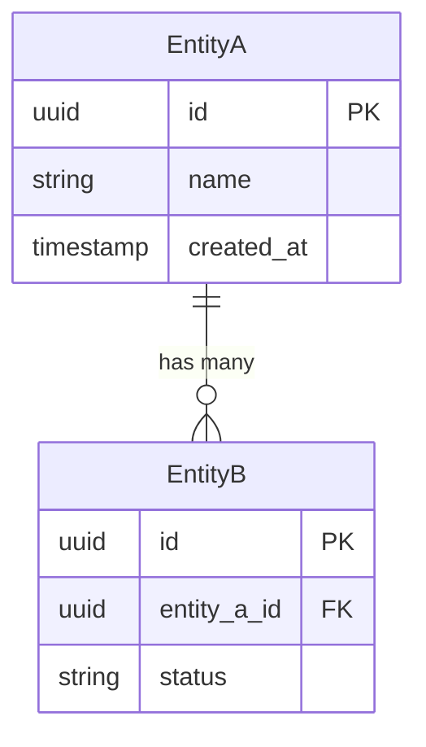

# Create a Product Requirements Document (PRD)

Generate a comprehensive PRD that defines WHAT to build and WHY, with clear user stories, acceptance criteria, and success metrics.

## Product/Feature Description

<product_description>
$ARGUMENTS
</product_description>

## Phase 1: Clarifying Questions

Before generating the PRD, ask the user 3-5 essential clarifying questions. Use this numbered format with lettered options for easy response:

<thinking>
Analyze the product description to identify gaps in understanding. Focus on questions that would significantly impact the PRD's clarity. Only ask questions when the answer isn't reasonably inferable from the description.
</thinking>

**Format your questions like this:**

```
1. What is the primary problem this solves?
   A. [Specific problem option]
   B. [Another problem option]
   C. [Third option]
   D. Other (please specify)

2. Who is the primary user?
   A. [User type option]
   B. [Another user type]
   C. [Third option]
   D. Other (please specify)
```

**Question areas to consider (pick 3-5 most critical):**

- **Problem/Goal**: What problem does this solve? What's the primary outcome?
- **Target Users**: Who will use this? What are their technical levels?
- **MVP Boundaries**: What's the absolute minimum to ship? What can wait for later?
- **Success Criteria**: How will we measure success? What metrics matter?
- **Technical Context**: Any existing systems to integrate with? Constraints?

**IMPORTANT:** Wait for user responses before proceeding to Phase 2.

---

## Phase 2: Generate Balanced PRD

After receiving answers, generate the PRD using this structure:

### PRD Template

```markdown
# PRD: [Feature/Product Name]

## 1. Overview

- **Version**: 1.0
- **Date**: [Today's date]
- **Author**: [User or team name if known]
- **Status**: Draft

### Problem Statement

[2-3 paragraphs describing the problem, who experiences it, and why it matters]

### Target Users

[Brief description of primary users and their context]

---

## 2. Goals & Non-Goals

### Business Goals

- [Goal 1]
- [Goal 2]
- [Goal 3]

### User Goals

- [What users want to achieve]
- [Pain points being addressed]

### Non-Goals (Out of Scope)

- [Explicit boundary 1] - *Rationale: [why excluded]*
- [Explicit boundary 2] - *Rationale: [why excluded]*

---

## 3. User Personas

### Key User Types

- **[Persona Name]**: [Brief description, needs, technical level]
- **[Persona Name]**: [Brief description, needs, technical level]

### Role-Based Access

| Role | Permissions | Key Actions |
|------|-------------|-------------|
| [Role] | [Access level] | [What they can do] |

---

## 4. User Stories

### US-001: [Story Title]

- **As a** [role]
- **I want** [capability]
- **So that** [value/benefit]

**Acceptance Criteria:**
- [ ] [Specific, testable criterion]
- [ ] [Another criterion]
- [ ] [Edge case handling]

### US-002: [Story Title]

[Continue pattern for all user stories...]

**Include for each feature area:**
- At least 1 happy path scenario
- At least 1 edge case or error scenario

---

## 5. Feature Prioritization (MoSCoW)

### Must Have (MVP Critical)

| ID | Feature | Description | Acceptance Criteria |
|----|---------|-------------|---------------------|
| FR-001 | [Name] | [What it does] | [How to verify] |

### Should Have (Important)

| ID | Feature | Description | Acceptance Criteria |
|----|---------|-------------|---------------------|
| FR-002 | [Name] | [What it does] | [How to verify] |

### Could Have (Nice-to-Have)

| ID | Feature | Description | Acceptance Criteria |
|----|---------|-------------|---------------------|
| FR-003 | [Name] | [What it does] | [How to verify] |

### Won't Have (Out of Scope)

- [Feature] - *Rationale: [why excluded from this version]*

---

## 6. User Experience

### Entry Points & First-Time Flow

1. [How users discover/access the feature]
2. [First-time user experience]
3. [Onboarding considerations]

### Core Experience

| Step | Action | System Response | Success State |
|------|--------|-----------------|---------------|
| 1 | [User action] | [What happens] | [Expected outcome] |
| 2 | [User action] | [What happens] | [Expected outcome] |

### Edge Cases & Error States

- **[Scenario]**: [How it's handled]
- **[Error condition]**: [User feedback and recovery path]

### Pages & Screens *(UI products only)*

| Page | Purpose | Key Components |
|------|---------|----------------|
| [Landing] | [Convert visitors] | [Hero, features, CTA] |
| [Dashboard] | [Main workspace] | [Nav, metrics, actions] |
| [Settings] | [User configuration] | [Profile, preferences] |

*Omit this section for APIs, CLIs, or backend services.*

---

## 7. Technical Considerations

### Integration Points

- [System/API to integrate with]
- [Data sources]

### Data Storage & Privacy

- [What data is stored]
- [Privacy considerations]
- [Retention requirements]

### Performance Requirements

- [Response time expectations]
- [Scale considerations]

### Potential Challenges

- [Technical challenge 1]
- [Technical challenge 2]

---

## 8. Success Metrics

### User-Centric Metrics

- [Metric]: [Target] - *How measured*
- [Metric]: [Target] - *How measured*

### Technical Metrics

- [Metric]: [Target] - *How measured*

---

## 9. Milestones

### MVP Scope

Based on Must Have requirements:
- [List of Must Have features forming MVP]

### Phase 1: MVP

**Complexity**: [Small/Medium/Large]

- [ ] [Must Have deliverable]
- [ ] [Must Have deliverable]

### Phase 2: Enhancement

**Complexity**: [Small/Medium/Large]

- [ ] [Should Have deliverable]
- [ ] [Could Have deliverable]

---

## 10. Open Questions

- [ ] [Question needing stakeholder input]
- [ ] [Unresolved decision]
```

---

## Phase 3: Review & Expansion Offer

After generating the balanced PRD:

1. **Save the file** to `docs/prd/prd-[feature-name].md`
2. **Present summary** of what was created
3. **Ask the user**:

```
PRD created at: docs/prd/prd-[feature-name].md

Would you like me to expand this PRD with additional technical depth?

**Technical expansion includes:**
- API Specifications (endpoints, schemas, auth)
- Data Model with Mermaid ERD diagram
- Security Considerations (AuthN/AuthZ, OWASP mapping)
- Performance & Scalability details (SLOs, scaling strategy)

Reply with:
- **"expand"** to add technical sections
- **"done"** if the balanced PRD is sufficient
- Or provide feedback on specific sections to revise
```

---

## Phase 4: Full Technical Expansion (If Requested)

If user requests expansion, add these sections to the PRD:

```markdown
---

## 11. API Specifications

### [Endpoint Name]

- **Method & Path**: `POST /api/v1/[resource]`
- **Purpose**: [What it does]
- **Auth**: [Scheme, required scopes/roles]

**Request Body:**
```json
{
  "field": "type (constraints)"
}
```

**Response (200):**
```json
{
  "field": "type"
}
```

**Errors:**
| Code | Message | Remediation |
|------|---------|-------------|
| 400 | [Error] | [How to fix] |
| 401 | [Error] | [How to fix] |

---

## 12. Data Model

### Entity Relationship Diagram



### Entity Details

| Entity | Attribute | Type | Constraints | Notes |
|--------|-----------|------|-------------|-------|
| [Name] | [attr] | [type] | [PK/FK/index] | [PII?] |

### Data Lifecycle

- **Retention**: [Policy]
- **Deletion**: [Soft/hard delete approach]
- **Archival**: [Strategy]

---

## 13. Security Considerations

### Authentication & Authorization

| Role | Permissions | Access Level |
|------|-------------|--------------|
| [Role] | [What they can do] | [Scope] |

### Data Protection

- **In Transit**: [TLS version, etc.]
- **At Rest**: [Encryption approach]
- **Secrets Management**: [Approach]

### OWASP Top 10 Mapping

| Threat | Mitigation |
|--------|------------|
| Injection | [Approach] |
| Broken Auth | [Approach] |
| [Relevant threats...] | [Approach] |

---

## 14. Performance & Scalability

### SLOs/SLIs

| Metric | Target | Measurement |
|--------|--------|-------------|
| Latency (p95) | [target] | [how measured] |
| Availability | [target] | [how measured] |
| Throughput | [target] | [how measured] |

### Scaling Strategy

- **Horizontal**: [Approach]
- **Vertical**: [Limits]
- **Caching**: [Strategy, TTL, invalidation]
- **Rate Limiting**: [Approach]
```

---

## Phase 5: Create Backlog Items (Optional)

After completing the PRD (and optional technical expansion), offer to create backlog items:

```
PRD complete. Would you like me to create backlog items from the user stories?

This will create items in your configured task system.
- **Backend:** [read from CLAUDE.md, or "files" if not configured]

Reply with:
- **"yes"** - Create items from Must Have features only
- **"all"** - Create items from all prioritized features
- **"no"** - Skip backlog creation
```

**If user accepts:**

1. Read backlog configuration from project CLAUDE.md (see backlog-manager skill)
2. For each user story or Must Have feature:
   - Extract title from story/feature
   - Format body with acceptance criteria
   - Set priority based on MoSCoW (Must=p1, Should=p2, Could=p3)
   - Create item using configured backend

**Item format:**

```markdown
## Source

From PRD: docs/prd/prd-[feature-name].md
User Story: US-001

## Problem Statement

[Extracted from user story context]

## Acceptance Criteria

[Copied from PRD acceptance criteria]
```

---

## Best Practices Applied

This PRD format follows industry best practices:

- **Clear, actionable language** - Specific requirements, not vague descriptions
- **User story IDs** - Traceable requirements (US-001, FR-001)
- **Testable acceptance criteria** - Measurable success conditions
- **Explicit scope boundaries** - Non-goals prevent scope creep
- **Balanced depth** - Comprehensive without overwhelming
- **Developer-ready** - Empowers "how" decisions while defining "what"

## Output

Save the final PRD to: `docs/prd/prd-[feature-name].md`

If the directory doesn't exist, create it first.
