# Mermaid Builder

## Overview

This skill provides comprehensive guidance for creating syntactically correct, maintainable, and effective Mermaid diagrams. Apply these standards when creating any Mermaid diagram to ensure proper syntax, clarity, and adherence to best practices.

## Core Philosophy

Prioritize:
- **Correctness**: Follow Mermaid syntax rules strictly to avoid rendering errors
- **Clarity**: Diagrams should communicate complex ideas simply
- **Simplicity**: Avoid overloading diagrams with unnecessary detail
- **Maintainability**: Use comments and consistent styling for long-term maintenance
- **Modularity**: Break complex diagrams into subgraphs or separate diagrams

## Critical Syntax Rules

### Label Quoting Rule (Enforce)

**RULE: Wrap labels in double quotes if they contain spaces, special characters, or punctuation.**

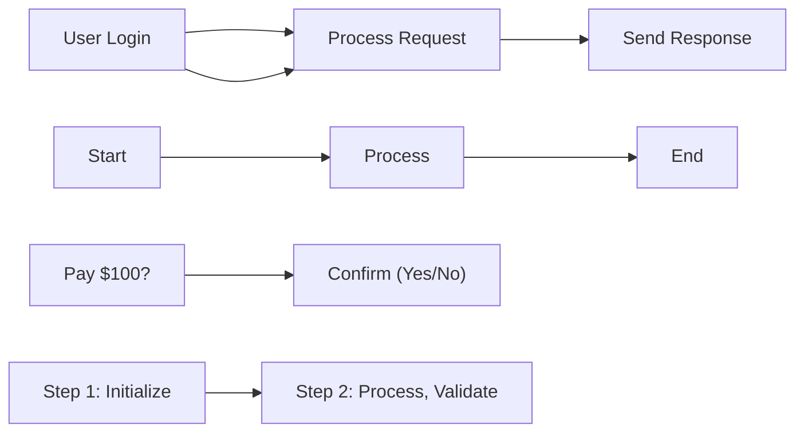

**When to use quotes:**
- Contains spaces: `"User Login"` ✓ vs `User Login` ✗
- Contains special characters: `"Pay $100?"` ✓
- Contains punctuation: `"Confirm, please"` ✓
- Contains operators: `"(Admin)"` ✓
- Contains colons: `"Step 1: Initialize"` ✓

**When quotes are optional:**
- Simple alphanumeric: `A`, `Node1`, `Start`, `UserProfile` (no quotes needed)
- Single words: `Login`, `Process`, `End` (no quotes needed)

**Best practice:** When in doubt, use quotes. It never hurts to quote a label.

### Node Definitions

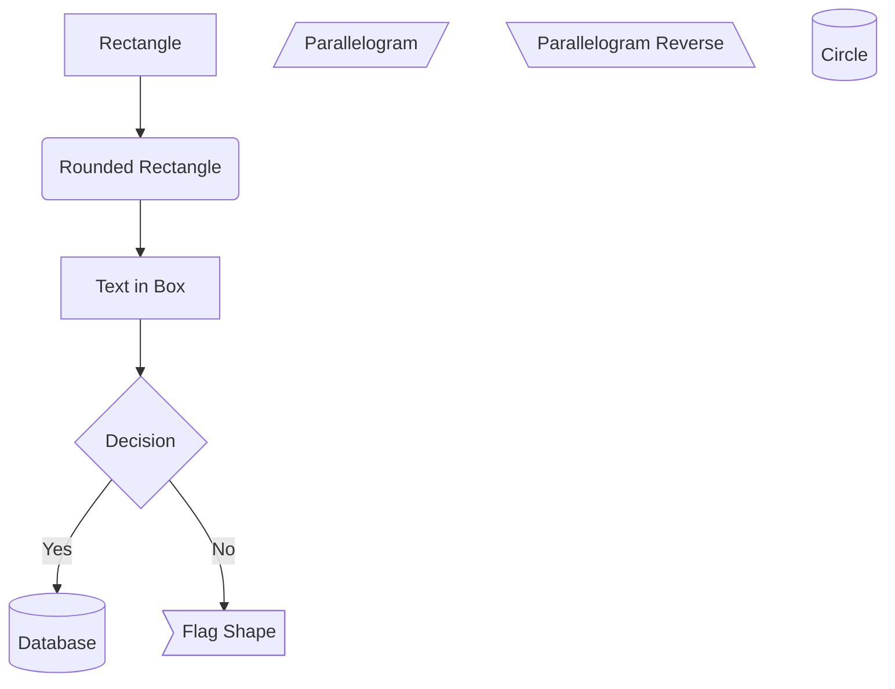

### Edge Types

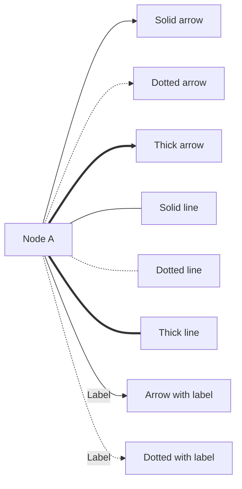

### Comments

Always use comments to document complex flows:

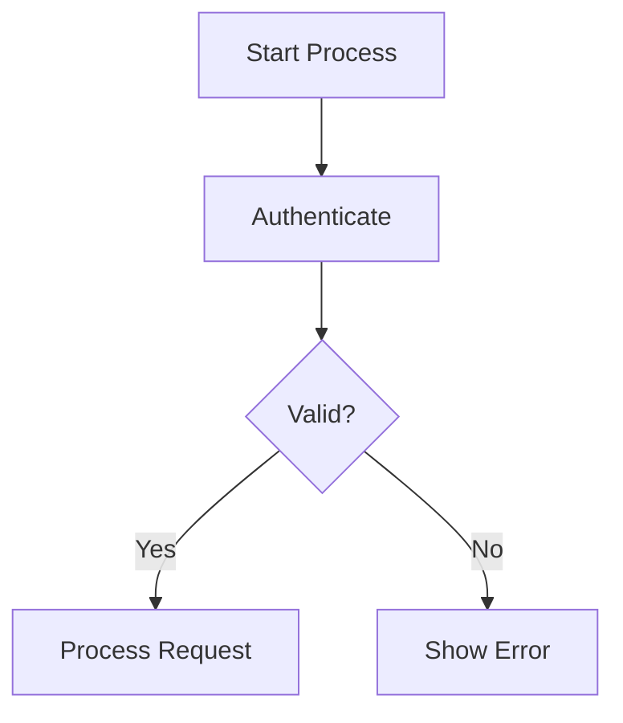

## Diagram Types and When to Use

### 1. Flowchart (Most Common)

**Use for:** Processes, workflows, decision trees, algorithm flows

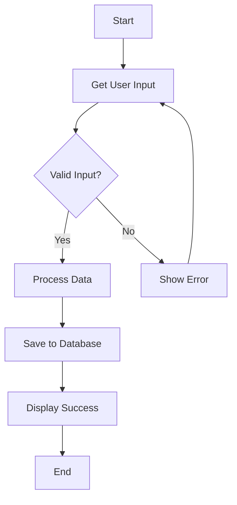

**Direction options:**
- `TB` or `TD` - Top to Bottom
- `BT` - Bottom to Top
- `LR` - Left to Right
- `RL` - Right to Left

### 2. Sequence Diagram

**Use for:** Interactions between components, API flows, message passing

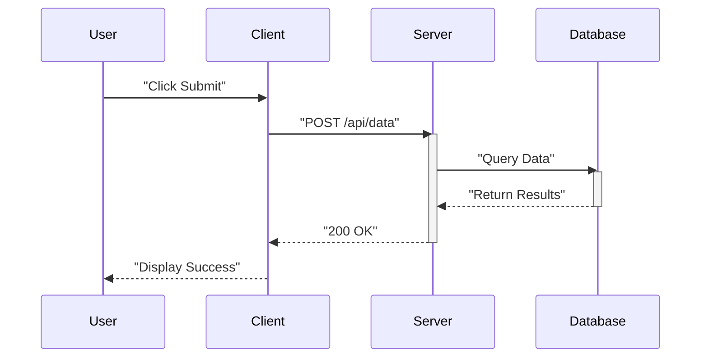

**Key elements:**
- `participant` - Define actors
- `->>` - Solid arrow (synchronous)
- `-->>` - Dotted arrow (response)
- `activate`/`deactivate` - Show activation bars

### 3. Class Diagram

**Use for:** Object-oriented system structure, database models

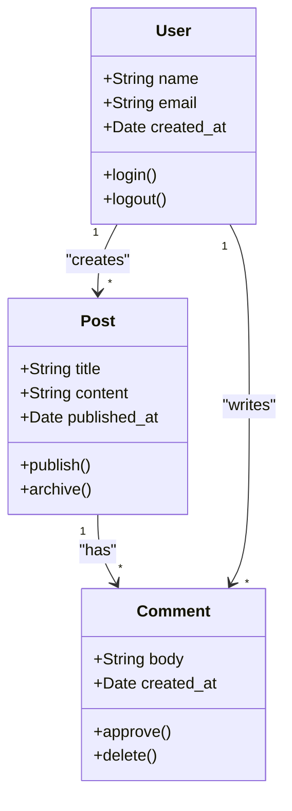

**Relationships:**
- `<|--` - Inheritance
- `*--` - Composition
- `o--` - Aggregation
- `-->` - Association
- `..>` - Dependency

### 4. State Diagram

**Use for:** State transitions, finite state machines, status flows

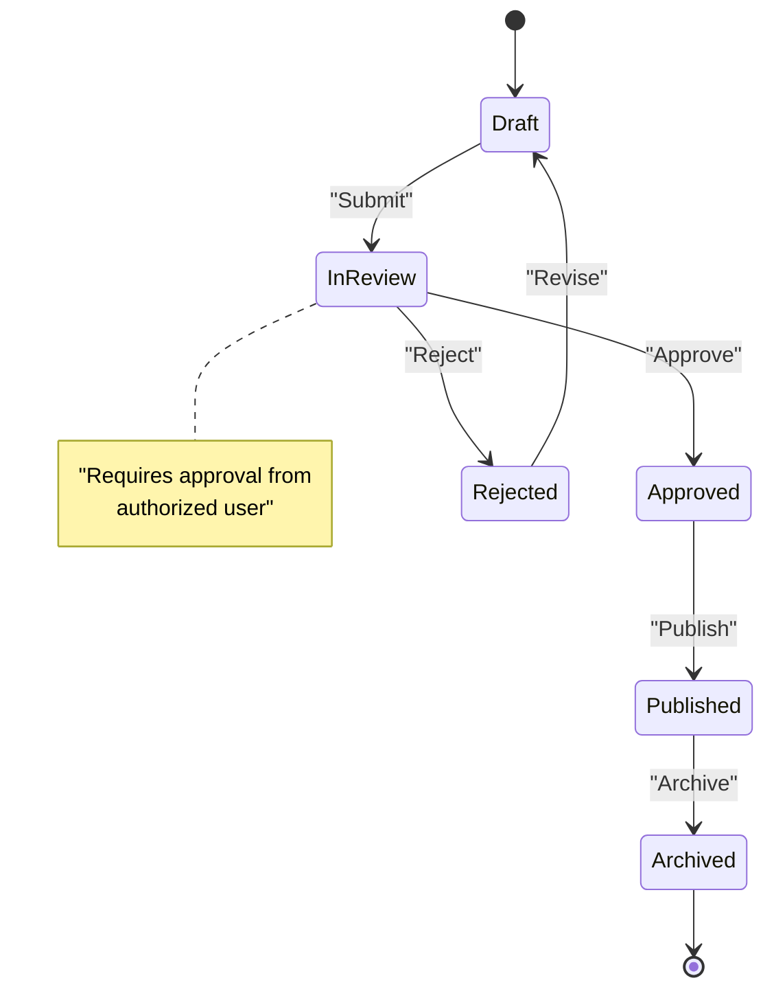

### 5. Gantt Chart

**Use for:** Project timelines, scheduling, task dependencies

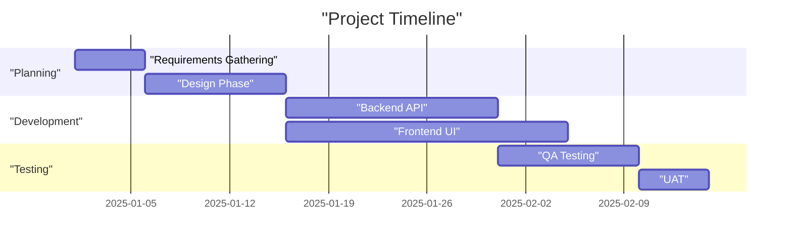

### 6. Entity-Relationship Diagram

**Use for:** Database schema design, data models

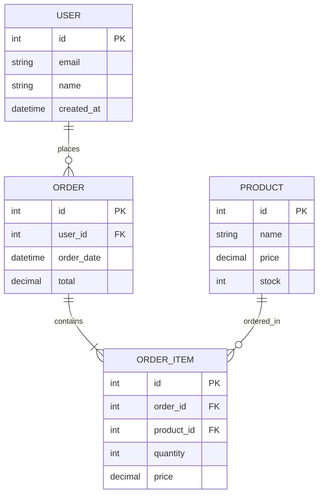

**Cardinality:**
- `||--||` - One to one
- `||--o{` - One to many
- `}o--o{` - Many to many
- `||--|{` - One to exactly many

### 7. Pie Chart

**Use for:** Proportional data, percentage breakdown

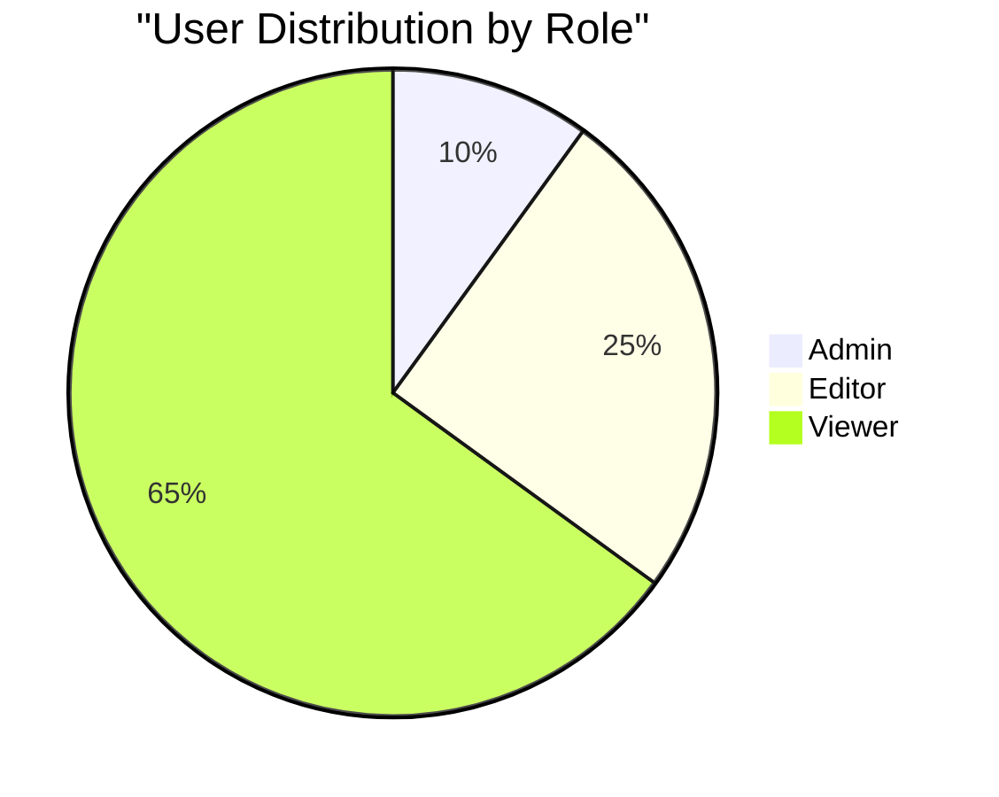

## Styling and Customization

### Define Custom Styles

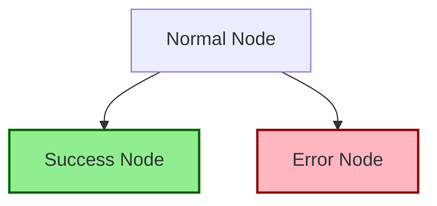

### Subgraphs for Organization

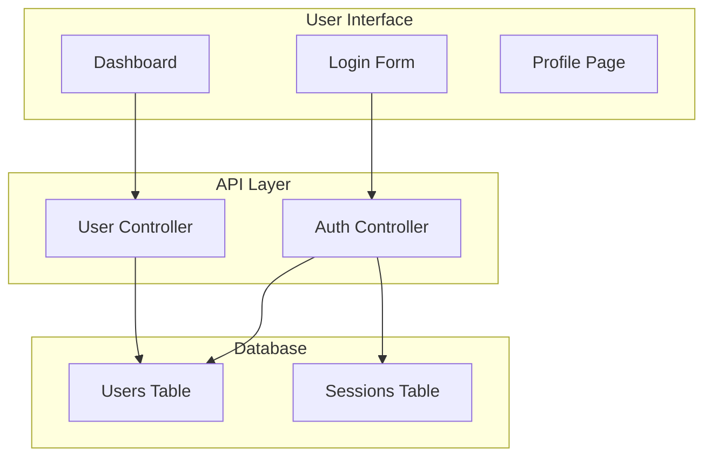

## Common Syntax Errors to Avoid

### 1. Unquoted Labels with Spaces

```mermaid
%% WRONG - will fail to render
flowchart LR
    A[User Login] --> B[Process Request]

%% CORRECT - labels with spaces quoted
flowchart LR
    A["User Login"] --> B["Process Request"]
```

### 2. Unmatched Brackets

```mermaid
%% WRONG - missing closing bracket
flowchart LR
    A["Node --> B["Another Node"]

%% CORRECT - properly closed
flowchart LR
    A["Node"] --> B["Another Node"]
```

### 3. Invalid Edge Syntax

```mermaid
%% WRONG - invalid arrow
flowchart LR
    A -> B

%% CORRECT - use proper arrow syntax
flowchart LR
    A --> B
```

### 4. Missing Quotes in Labels with Special Characters

```mermaid
%% WRONG - special characters without quotes
flowchart LR
    A[Cost: $100] --> B[Discount (10%)]

%% CORRECT - special characters quoted
flowchart LR
    A["Cost: $100"] --> B["Discount (10%)"]
```

### 5. Inconsistent Node IDs

```mermaid
%% WRONG - Node1 defined twice with different shapes
flowchart LR
    Node1["First"] --> Node2["Second"]
    Node1("Different Shape")

%% CORRECT - unique IDs for each node
flowchart LR
    Node1["First"] --> Node2["Second"]
    Node3("Different Shape")
```

## Best Practices

### 1. Use Meaningful Node IDs

```mermaid
%% GOOD - descriptive IDs
flowchart TD
    UserLogin["User Login"] --> AuthCheck{Authenticate?}
    AuthCheck -->|Yes| Dashboard["Show Dashboard"]
    AuthCheck -->|No| LoginError["Show Error"]

%% AVOID - unclear IDs
flowchart TD
    A["User Login"] --> B{Authenticate?}
    B -->|Yes| C["Show Dashboard"]
    B -->|No| D["Show Error"]
```

### 2. Keep Diagrams Simple

Break complex diagrams into multiple smaller diagrams or use subgraphs:

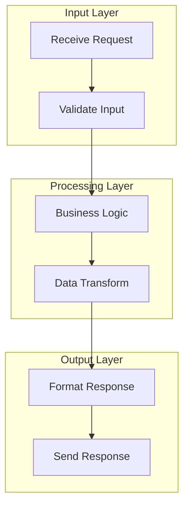

### 3. Use Comments Liberally

```mermaid
flowchart TD
    %% User Authentication Flow
    %% Updated: 2025-01-15

    Start["Start"] --> Login["User Login"]

    %% Check credentials against database
    Login --> Auth{Valid Credentials?}

    %% Success path
    Auth -->|Yes| Token["Generate Token"]
    Token --> Success["Redirect to Dashboard"]

    %% Failure path - allow retry
    Auth -->|No| Error["Show Error"]
    Error --> Login
```

### 4. Consistent Styling

Use `classDef` for consistent appearance:

```mermaid
flowchart TD
    Start["Start"]
    Process1["Process Step"]
    Process2["Another Step"]
    Success["Success"]
    Error["Error"]

    Start --> Process1
    Process1 --> Process2
    Process2 --> Success
    Process1 --> Error

    classDef processStyle fill:#E3F2FD,stroke:#1976D2
    classDef successStyle fill:#C8E6C9,stroke:#388E3C
    classDef errorStyle fill:#FFCDD2,stroke:#D32F2F

    class Process1,Process2 processStyle
    class Success successStyle
    class Error errorStyle
```

### 5. Preview and Validate

Always preview your diagram before committing:
- Use online editors (mermaid.live)
- Check for syntax errors
- Verify labels display correctly
- Test in target environment

## Validation Checklist

Before finalizing any Mermaid diagram, verify:

- [ ] All labels with spaces are quoted
- [ ] All labels with special characters are quoted
- [ ] All labels with punctuation are quoted
- [ ] All brackets are properly matched
- [ ] Edge syntax is correct (-->, --->, etc.)
- [ ] Node IDs are unique and meaningful
- [ ] Comments explain complex sections
- [ ] Diagram direction is appropriate (TD, LR, etc.)
- [ ] Diagram type matches use case
- [ ] Styling is consistent across nodes
- [ ] Diagram is not overly complex
- [ ] Subgraphs are used for organization if needed
- [ ] No syntax errors when previewed

## Quick Reference

### Flowchart Shapes
- `["Rectangle"]` - Rectangle
- `("Rounded")` - Rounded rectangle
- `{"Diamond"}` - Diamond (decision)
- `[("Database")]` - Cylinder
- `(("Circle"))` - Circle
- `>"Flag"]` - Asymmetric
- `[/"Parallelogram"/]` - Parallelogram

### Common Arrow Types
- `-->` - Solid arrow
- `---` - Solid line
- `-.->` - Dotted arrow
- `-.-` - Dotted line
- `==>` - Thick arrow
- `===` - Thick line
- `-->|Label|` - Arrow with label

### Diagram Types
- `flowchart TD` - Flowchart top-down
- `sequenceDiagram` - Sequence diagram
- `classDiagram` - Class diagram
- `stateDiagram-v2` - State diagram
- `gantt` - Gantt chart
- `erDiagram` - ER diagram
- `pie` - Pie chart

## Resources

- Official Mermaid documentation: https://mermaid.js.org/
- Mermaid Live Editor: https://mermaid.live/
- Syntax reference: https://mermaid.js.org/intro/syntax-reference.html

## Common Patterns

### Decision Flow Pattern

```mermaid
flowchart TD
    Start["Start"] --> Input["Get Input"]
    Input --> Validate{Valid?}
    Validate -->|Yes| Process["Process"]
    Validate -->|No| Error["Show Error"]
    Error --> Input
    Process --> End["End"]
```

### Service Architecture Pattern

```mermaid
flowchart LR
    Client["Client"] --> Gateway["API Gateway"]
    Gateway --> Auth["Auth Service"]
    Gateway --> Users["User Service"]
    Gateway --> Orders["Order Service"]

    Users --> DB1[("User DB")]
    Orders --> DB2[("Order DB")]
    Auth --> Cache[("Redis Cache")]
```

### State Machine Pattern

```mermaid
stateDiagram-v2
    [*] --> Created
    Created --> Active : "activate"
    Active --> Suspended : "suspend"
    Suspended --> Active : "resume"
    Active --> Deleted : "delete"
    Suspended --> Deleted : "delete"
    Deleted --> [*]
```

Remember: **When in doubt about label syntax, always use double quotes. The quoting rule is the #1 cause of Mermaid rendering failures.**
