# Mermaid Builder

## Overview

This skill provides comprehensive guidance for creating syntactically correct, maintainable, and effective Mermaid diagrams. Apply these standards when creating any Mermaid diagram to ensure proper syntax, clarity, and adherence to best practices.

**Includes specialized patterns for:**
- Data lineage visualization (ETL pipelines, data flows, schema relationships)
- System architecture diagrams
- Process workflows and decision trees
- Database schema and entity relationships
- Project timelines and state machines

## Core Philosophy

Prioritize:
- **Correctness**: Follow Mermaid syntax rules strictly to avoid rendering errors
- **Clarity**: Diagrams should communicate complex ideas simply
- **Simplicity**: Avoid overloading diagrams with unnecessary detail
- **Maintainability**: Use comments and consistent styling for long-term maintenance
- **Modularity**: Break complex diagrams into subgraphs or separate diagrams

## Critical Syntax Rules

### Label Quoting Rule (Enforce)

**RULE: Wrap labels in double quotes if they contain spaces, special characters, or punctuation.**

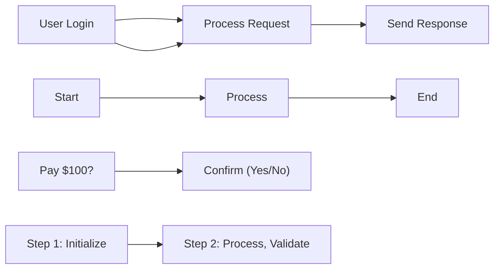

**When to use quotes:**
- Contains spaces: `"User Login"` ✓ vs `User Login` ✗
- Contains special characters: `"Pay $100?"` ✓
- Contains punctuation: `"Confirm, please"` ✓
- Contains operators: `"(Admin)"` ✓
- Contains colons: `"Step 1: Initialize"` ✓

**When quotes are optional:**
- Simple alphanumeric: `A`, `Node1`, `Start`, `UserProfile` (no quotes needed)
- Single words: `Login`, `Process`, `End` (no quotes needed)

**Best practice:** When in doubt, use quotes. It never hurts to quote a label.

### Node Definitions

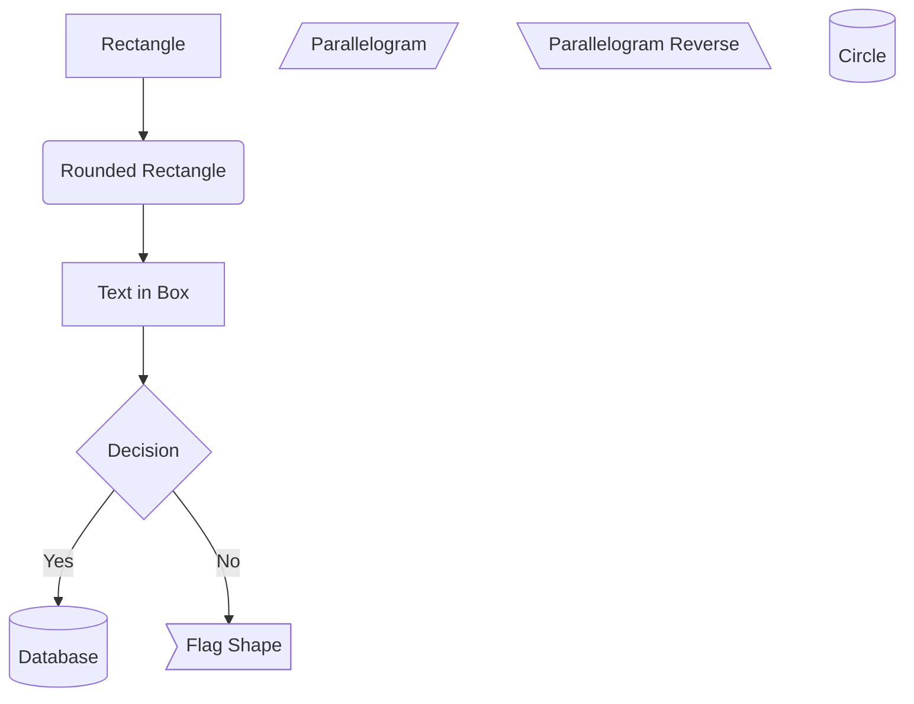

### Edge Types

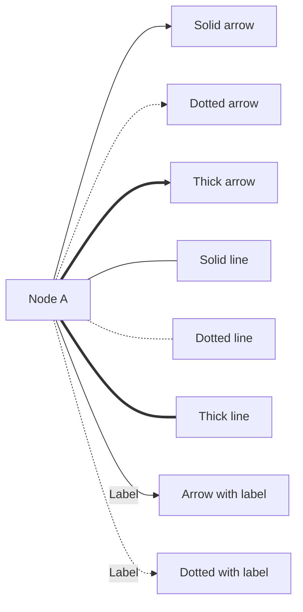

### Comments

Always use comments to document complex flows:

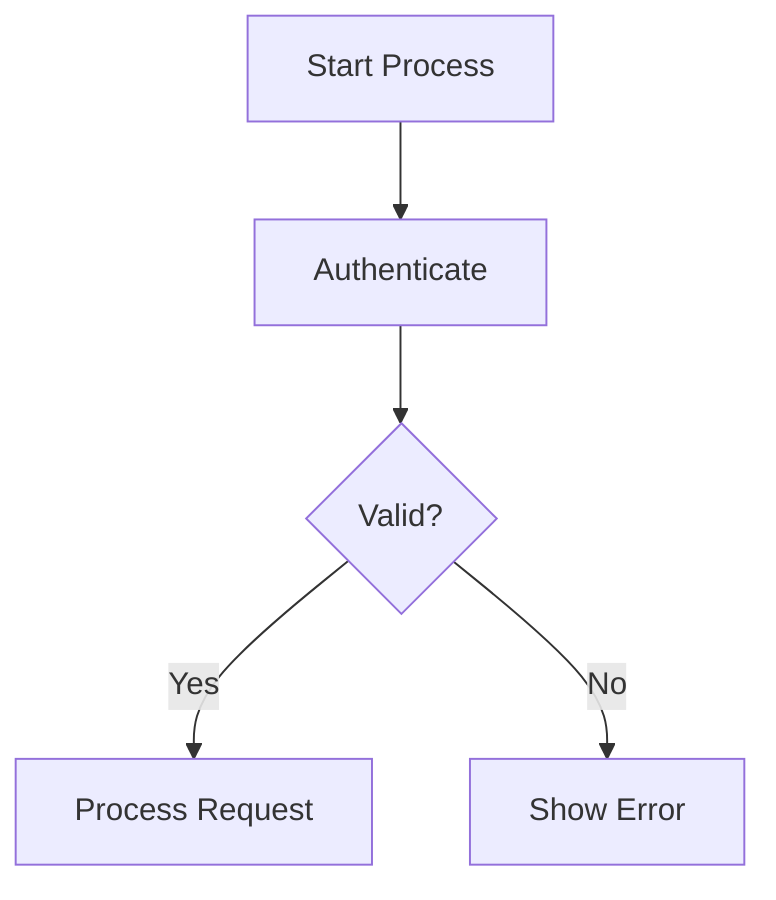

## Diagram Types and When to Use

### 1. Flowchart (Most Common)

**Use for:** Processes, workflows, decision trees, algorithm flows

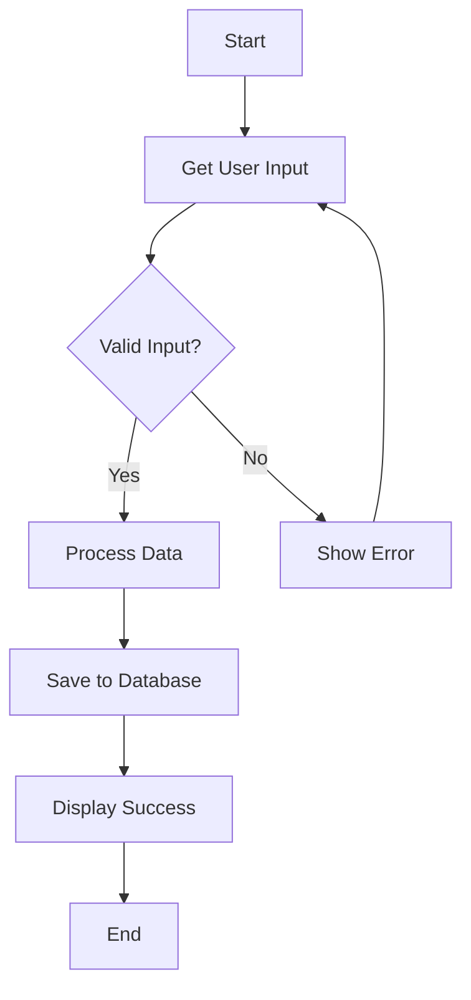

**Direction options:**
- `TB` or `TD` - Top to Bottom
- `BT` - Bottom to Top
- `LR` - Left to Right
- `RL` - Right to Left

### 2. Sequence Diagram

**Use for:** Interactions between components, API flows, message passing

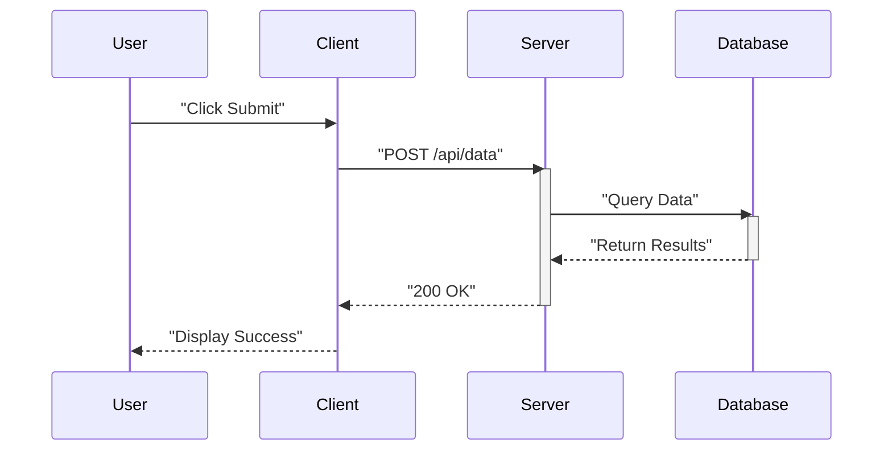

**Key elements:**
- `participant` - Define actors
- `->>` - Solid arrow (synchronous)
- `-->>` - Dotted arrow (response)
- `activate`/`deactivate` - Show activation bars

### 3. Class Diagram

**Use for:** Object-oriented system structure, database models

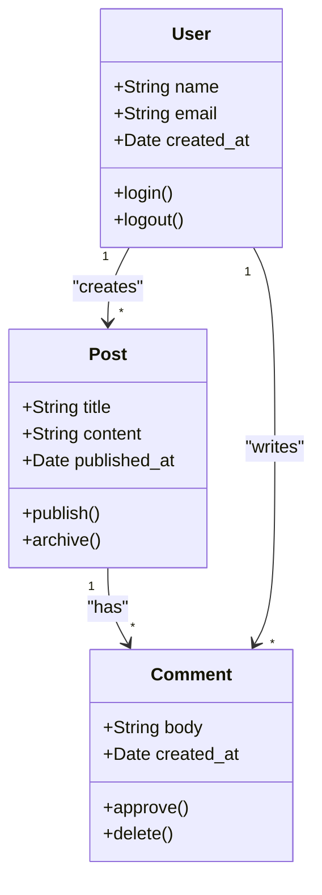

**Relationships:**
- `<|--` - Inheritance
- `*--` - Composition
- `o--` - Aggregation
- `-->` - Association
- `..>` - Dependency

### 4. State Diagram

**Use for:** State transitions, finite state machines, status flows

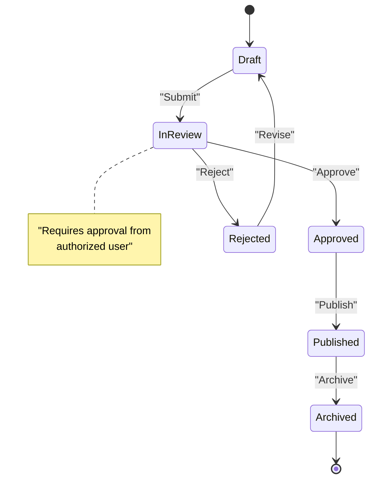

### 5. Gantt Chart

**Use for:** Project timelines, scheduling, task dependencies

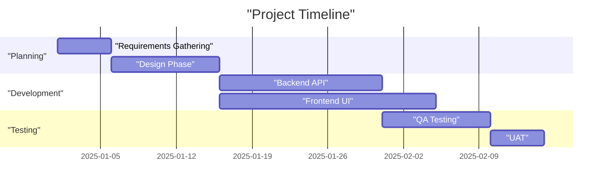

### 6. Entity-Relationship Diagram

**Use for:** Database schema design, data models

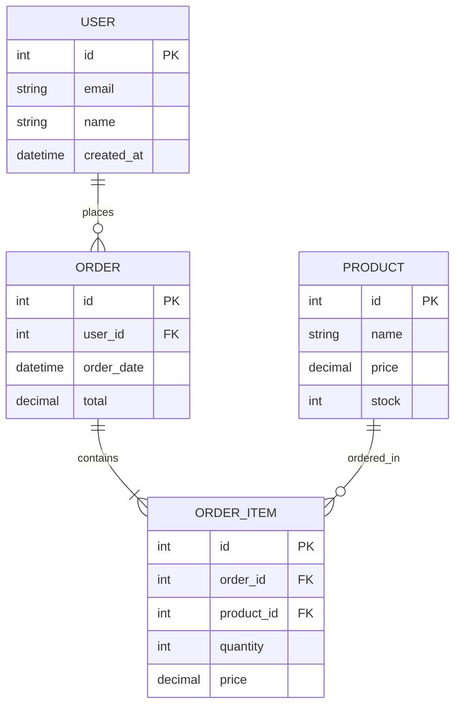

**Cardinality:**
- `||--||` - One to one
- `||--o{` - One to many
- `}o--o{` - Many to many
- `||--|{` - One to exactly many

### 7. Pie Chart

**Use for:** Proportional data, percentage breakdown

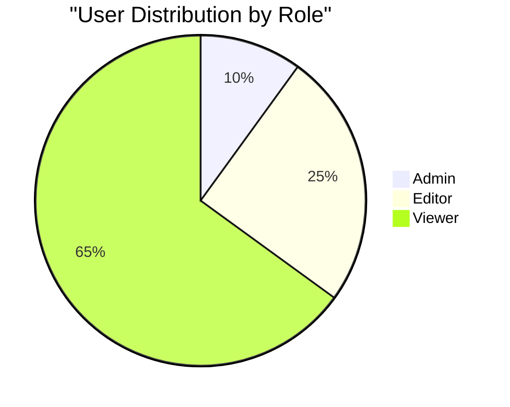

## Styling and Customization

### Define Custom Styles

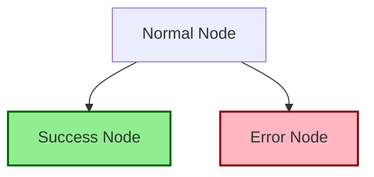

### Subgraphs for Organization

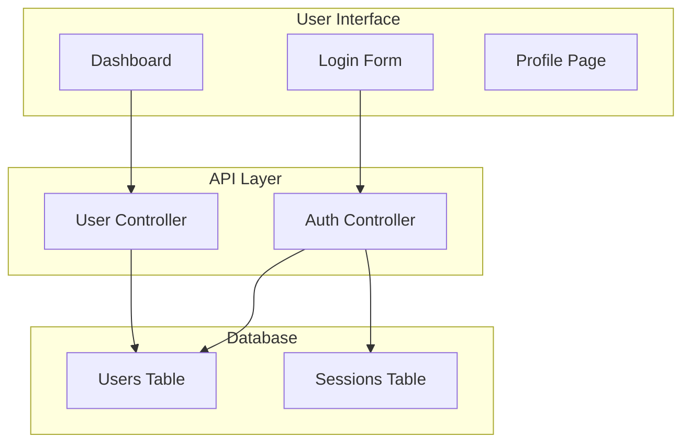

## Common Syntax Errors to Avoid

### 1. Unquoted Labels with Spaces

```mermaid
%% WRONG - will fail to render
flowchart LR
    A[User Login] --> B[Process Request]

%% CORRECT - labels with spaces quoted
flowchart LR
    A["User Login"] --> B["Process Request"]
```

### 2. Unmatched Brackets

```mermaid
%% WRONG - missing closing bracket
flowchart LR
    A["Node --> B["Another Node"]

%% CORRECT - properly closed
flowchart LR
    A["Node"] --> B["Another Node"]
```

### 3. Invalid Edge Syntax

```mermaid
%% WRONG - invalid arrow
flowchart LR
    A -> B

%% CORRECT - use proper arrow syntax
flowchart LR
    A --> B
```

### 4. Missing Quotes in Labels with Special Characters

```mermaid
%% WRONG - special characters without quotes
flowchart LR
    A[Cost: $100] --> B[Discount (10%)]

%% CORRECT - special characters quoted
flowchart LR
    A["Cost: $100"] --> B["Discount (10%)"]
```

### 5. Inconsistent Node IDs

```mermaid
%% WRONG - Node1 defined twice with different shapes
flowchart LR
    Node1["First"] --> Node2["Second"]
    Node1("Different Shape")

%% CORRECT - unique IDs for each node
flowchart LR
    Node1["First"] --> Node2["Second"]
    Node3("Different Shape")
```

## Best Practices

### 1. Use Meaningful Node IDs

```mermaid
%% GOOD - descriptive IDs
flowchart TD
    UserLogin["User Login"] --> AuthCheck{Authenticate?}
    AuthCheck -->|Yes| Dashboard["Show Dashboard"]
    AuthCheck -->|No| LoginError["Show Error"]

%% AVOID - unclear IDs
flowchart TD
    A["User Login"] --> B{Authenticate?}
    B -->|Yes| C["Show Dashboard"]
    B -->|No| D["Show Error"]
```

### 2. Keep Diagrams Simple

Break complex diagrams into multiple smaller diagrams or use subgraphs:

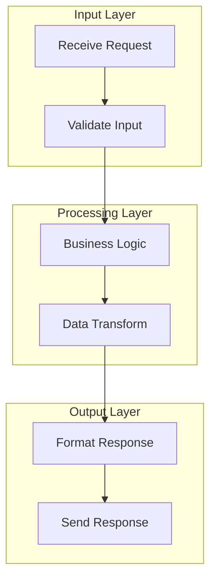

### 3. Use Comments Liberally

```mermaid
flowchart TD
    %% User Authentication Flow
    %% Updated: 2025-01-15

    Start["Start"] --> Login["User Login"]

    %% Check credentials against database
    Login --> Auth{Valid Credentials?}

    %% Success path
    Auth -->|Yes| Token["Generate Token"]
    Token --> Success["Redirect to Dashboard"]

    %% Failure path - allow retry
    Auth -->|No| Error["Show Error"]
    Error --> Login
```

### 4. Consistent Styling

Use `classDef` for consistent appearance:

```mermaid
flowchart TD
    Start["Start"]
    Process1["Process Step"]
    Process2["Another Step"]
    Success["Success"]
    Error["Error"]

    Start --> Process1
    Process1 --> Process2
    Process2 --> Success
    Process1 --> Error

    classDef processStyle fill:#E3F2FD,stroke:#1976D2
    classDef successStyle fill:#C8E6C9,stroke:#388E3C
    classDef errorStyle fill:#FFCDD2,stroke:#D32F2F

    class Process1,Process2 processStyle
    class Success successStyle
    class Error errorStyle
```

### 5. Preview and Validate

Always preview your diagram before committing:
- Use online editors (mermaid.live)
- Check for syntax errors
- Verify labels display correctly
- Test in target environment

## Validation Checklist

Before finalizing any Mermaid diagram, verify:

- [ ] All labels with spaces are quoted
- [ ] All labels with special characters are quoted
- [ ] All labels with punctuation are quoted
- [ ] All brackets are properly matched
- [ ] Edge syntax is correct (-->, --->, etc.)
- [ ] Node IDs are unique and meaningful
- [ ] Comments explain complex sections
- [ ] Diagram direction is appropriate (TD, LR, etc.)
- [ ] Diagram type matches use case
- [ ] Styling is consistent across nodes
- [ ] Diagram is not overly complex
- [ ] Subgraphs are used for organization if needed
- [ ] No syntax errors when previewed

## Quick Reference

### Flowchart Shapes
- `["Rectangle"]` - Rectangle
- `("Rounded")` - Rounded rectangle
- `{"Diamond"}` - Diamond (decision)
- `[("Database")]` - Cylinder
- `(("Circle"))` - Circle
- `>"Flag"]` - Asymmetric
- `[/"Parallelogram"/]` - Parallelogram

### Common Arrow Types
- `-->` - Solid arrow
- `---` - Solid line
- `-.->` - Dotted arrow
- `-.-` - Dotted line
- `==>` - Thick arrow
- `===` - Thick line
- `-->|Label|` - Arrow with label

### Diagram Types
- `flowchart TD` - Flowchart top-down
- `sequenceDiagram` - Sequence diagram
- `classDiagram` - Class diagram
- `stateDiagram-v2` - State diagram
- `gantt` - Gantt chart
- `erDiagram` - ER diagram
- `pie` - Pie chart

## Resources

- Official Mermaid documentation: https://mermaid.js.org/
- Mermaid Live Editor: https://mermaid.live/
- Syntax reference: https://mermaid.js.org/intro/syntax-reference.html

## Data Lineage Visualization Patterns

### Overview

Data lineage diagrams trace how data flows through systems, showing sources, transformations, and destinations. Use flowcharts for simple pipelines, sequence diagrams for cross-system flows, and ER diagrams for schema relationships.

### Simple Data Pipeline Pattern

**Use for:** ETL processes, data transformations, single-direction flows

```mermaid
flowchart LR
    %% Data Sources
    Source1[("Source DB")] --> Extract["Extract"]
    Source2[("API")] --> Extract
    Source3[("CSV Files")] --> Extract

    %% Transformation Layer
    Extract --> Transform["Transform & Clean"]
    Transform --> Enrich["Enrich Data"]
    Enrich --> Validate{Valid?}

    %% Error Handling
    Validate -->|No| ErrorLog[("Error Log")]
    ErrorLog --> ManualReview["Manual Review"]
    ManualReview --> Transform

    %% Success Path
    Validate -->|Yes| Load["Load to Warehouse"]
    Load --> Target[("Data Warehouse")]

    %% Styling for clarity
    classDef sourceStyle fill:#E3F2FD,stroke:#1976D2
    classDef processStyle fill:#FFF9C4,stroke:#F57F17
    classDef targetStyle fill:#C8E6C9,stroke:#388E3C
    classDef errorStyle fill:#FFCDD2,stroke:#D32F2F

    class Source1,Source2,Source3 sourceStyle
    class Extract,Transform,Enrich,Load processStyle
    class Target targetStyle
    class ErrorLog,ManualReview errorStyle
```

### Multi-Layer Data Architecture

**Use for:** Complex data platforms with multiple layers

```mermaid
flowchart TD
    subgraph "Source Layer"
        S1[("CRM DB")]
        S2[("ERP DB")]
        S3[("Web Events")]
    end

    subgraph "Ingestion Layer"
        I1["CDC Connector"]
        I2["Batch Import"]
        I3["Stream Processor"]
    end

    subgraph "Raw Data Lake"
        R1[("Raw JSON")]
        R2[("Raw Parquet")]
    end

    subgraph "Transformation Layer"
        T1["Clean & Normalize"]
        T2["Join & Aggregate"]
        T3["Calculate Metrics"]
    end

    subgraph "Curated Layer"
        C1[("Fact Tables")]
        C2[("Dimension Tables")]
        C3[("Aggregated Views")]
    end

    subgraph "Consumption Layer"
        D1["BI Dashboard"]
        D2["ML Models"]
        D3["API"]
    end

    %% Data flow
    S1 --> I1 --> R1
    S2 --> I2 --> R2
    S3 --> I3 --> R1

    R1 --> T1
    R2 --> T1
    T1 --> T2
    T2 --> T3

    T3 --> C1
    T3 --> C2
    T3 --> C3

    C1 --> D1
    C2 --> D1
    C1 --> D2
    C3 --> D3
```

### Cross-System Data Flow

**Use for:** Showing data movement between systems with timing

```mermaid
sequenceDiagram
    participant Source as Source System
    participant Queue as Message Queue
    participant ETL as ETL Service
    participant DWH as Data Warehouse
    participant Cache as Redis Cache
    participant API as Analytics API

    Source->>Queue: Publish event (real-time)
    activate Queue
    Queue->>ETL: Consume event
    deactivate Queue
    activate ETL

    ETL->>ETL: Transform & enrich
    ETL->>DWH: Batch insert (every 5 min)
    activate DWH
    DWH-->>ETL: Acknowledge
    deactivate DWH

    ETL->>Cache: Update aggregates
    deactivate ETL
    activate Cache
    Cache-->>ETL: Confirm
    deactivate Cache

    API->>Cache: Query latest metrics
    activate Cache
    Cache-->>API: Return cached data
    deactivate Cache

    API->>DWH: Query historical data
    activate DWH
    DWH-->>API: Return results
    deactivate DWH
```

### Database Schema Lineage

**Use for:** Showing table relationships and data provenance

```mermaid
erDiagram
    RAW_EVENTS ||--o{ CLEANED_EVENTS : "cleaned_from"
    CLEANED_EVENTS ||--o{ USER_FACTS : "aggregated_into"
    CLEANED_EVENTS ||--o{ PRODUCT_FACTS : "aggregated_into"

    USER_DIMENSION ||--o{ USER_FACTS : "enriches"
    PRODUCT_DIMENSION ||--o{ PRODUCT_FACTS : "enriches"

    USER_FACTS ||--o{ CUSTOMER_360 : "joined_into"
    PRODUCT_FACTS ||--o{ CUSTOMER_360 : "joined_into"

    RAW_EVENTS {
        bigint id PK
        timestamp event_time
        string event_type
        json payload
        string source_system
    }

    CLEANED_EVENTS {
        bigint id PK
        bigint raw_event_id FK
        timestamp processed_at
        string user_id
        string product_id
        decimal amount
    }

    USER_FACTS {
        string user_id PK
        date date PK
        int event_count
        decimal total_amount
        timestamp last_updated
        string derived_from "CLEANED_EVENTS"
    }

    PRODUCT_FACTS {
        string product_id PK
        date date PK
        int view_count
        int purchase_count
        timestamp last_updated
        string derived_from "CLEANED_EVENTS"
    }

    CUSTOMER_360 {
        string user_id PK
        json user_profile
        json purchase_history
        json product_preferences
        timestamp refreshed_at
    }
```

### Data Transformation Flow with Metadata

**Use for:** Documenting transformation logic and data quality

```mermaid
flowchart TD
    Source[("Source: users_raw<br/>Records: 1.2M<br/>Updated: Hourly")] --> Clean

    subgraph "Cleaning Stage"
        Clean["Remove duplicates<br/>Standardize formats<br/>Fill missing values"]
        Clean --> QC1{Quality Check:<br/>Completeness > 95%?}
        QC1 -->|Fail| Alert1["Alert: Data Quality Issue"]
        QC1 -->|Pass| Dedupe
    end

    Dedupe["Deduplicate by email<br/>Keep latest record"] --> Enrich

    subgraph "Enrichment Stage"
        Enrich["Join with geo_data<br/>Lookup company info<br/>Calculate segments"]
        Enrich --> QC2{Quality Check:<br/>Join rate > 80%?}
        QC2 -->|Fail| Alert2["Alert: Enrichment Issue"]
        QC2 -->|Pass| Final
    end

    Final[("Target: users_clean<br/>Records: 980K<br/>Refresh: Every 4h<br/>Retention: 2 years")]

    Alert1 --> Notify["Send to Data Team"]
    Alert2 --> Notify

    %% Add metadata as notes
    classDef sourceStyle fill:#E1F5FF,stroke:#01579B,stroke-width:3px
    classDef processStyle fill:#FFF9C4,stroke:#F57F17,stroke-width:2px
    classDef targetStyle fill:#C8E6C9,stroke:#2E7D32,stroke-width:3px
    classDef alertStyle fill:#FFCDD2,stroke:#C62828,stroke-width:2px

    class Source sourceStyle
    class Clean,Dedupe,Enrich processStyle
    class Final targetStyle
    class Alert1,Alert2,Notify alertStyle
```

### Streaming Data Lineage

**Use for:** Real-time data pipelines with Kafka, Kinesis, etc.

```mermaid
flowchart LR
    subgraph "Producers"
        P1["Web App Events"]
        P2["Mobile App Events"]
        P3["IoT Sensors"]
    end

    subgraph "Streaming Platform"
        T1["Topic: raw_events<br/>Partitions: 12<br/>Retention: 7d"]
        T2["Topic: enriched_events<br/>Partitions: 12<br/>Retention: 30d"]
        T3["Topic: alerts<br/>Partitions: 3<br/>Retention: 90d"]
    end

    subgraph "Stream Processors"
        SP1["Enrichment<br/>Consumer Group: enrichers"]
        SP2["Anomaly Detection<br/>Consumer Group: detectors"]
        SP3["Aggregation<br/>Consumer Group: aggregators"]
    end

    subgraph "Sinks"
        Sink1[("S3 Data Lake")]
        Sink2[("Elasticsearch")]
        Sink3[("Time Series DB")]
        Sink4["PagerDuty"]
    end

    P1 --> T1
    P2 --> T1
    P3 --> T1

    T1 --> SP1
    T1 --> SP2
    SP1 --> T2

    T2 --> SP3
    SP2 --> T3

    T1 -.->|Archive| Sink1
    T2 --> Sink2
    SP3 --> Sink3
    T3 --> Sink4

    classDef topicStyle fill:#E8EAF6,stroke:#3F51B5,stroke-width:2px
    classDef processorStyle fill:#FFF9C4,stroke:#F57F17,stroke-width:2px

    class T1,T2,T3 topicStyle
    class SP1,SP2,SP3 processorStyle
```

### Column-Level Lineage

**Use for:** Detailed field-level data provenance

```mermaid
flowchart TD
    subgraph "Source Tables"
        S1["orders.order_id"]
        S2["orders.customer_id"]
        S3["orders.order_total"]
        S4["customers.customer_id"]
        S5["customers.customer_name"]
        S6["customers.country"]
    end

    subgraph "Transformations"
        T1["1:1 Copy"]
        T2["JOIN ON customer_id"]
        T3["SUM(order_total)<br/>GROUP BY customer_id"]
        T4["UPPER(customer_name)"]
    end

    subgraph "Target Table: customer_summary"
        D1["customer_id"]
        D2["customer_name_upper"]
        D3["total_orders"]
        D4["country"]
    end

    S1 --> T1
    T1 -.-> D3

    S2 --> T2
    S4 --> T2
    T2 --> D1

    S3 --> T3
    T3 --> D3

    S5 --> T4
    T4 --> D2

    S6 --> T2
    T2 --> D4

    classDef sourceStyle fill:#E3F2FD,stroke:#1976D2
    classDef transformStyle fill:#FFF9C4,stroke:#F57F17
    classDef targetStyle fill:#C8E6C9,stroke:#388E3C

    class S1,S2,S3,S4,S5,S6 sourceStyle
    class T1,T2,T3,T4 transformStyle
    class D1,D2,D3,D4 targetStyle
```

### Best Practices for Data Lineage Diagrams

1. **Show directionality clearly** - Data flows left-to-right or top-to-bottom
2. **Include metadata** - Record counts, refresh frequency, retention policies
3. **Highlight transformations** - Make it obvious where data changes
4. **Use consistent styling** - Sources, processes, and targets have distinct colors
5. **Add data quality checks** - Show validation points and error handling
6. **Document timing** - Batch intervals, streaming latency, refresh schedules
7. **Keep it focused** - Break complex pipelines into multiple diagrams by layer

### Common Anti-Patterns to Avoid

❌ **Too much detail** - Don't show every column in a large schema
❌ **Bidirectional flows** - Avoid showing data flowing both ways (creates confusion)
❌ **Missing transformations** - Don't just show sources and targets, show what happens in between
❌ **Inconsistent granularity** - Mix table-level and column-level lineage carefully
❌ **No metadata** - Include refresh frequency, record counts, or data quality metrics

## Common Patterns

### Decision Flow Pattern

```mermaid
flowchart TD
    Start["Start"] --> Input["Get Input"]
    Input --> Validate{Valid?}
    Validate -->|Yes| Process["Process"]
    Validate -->|No| Error["Show Error"]
    Error --> Input
    Process --> End["End"]
```

### Service Architecture Pattern

```mermaid
flowchart LR
    Client["Client"] --> Gateway["API Gateway"]
    Gateway --> Auth["Auth Service"]
    Gateway --> Users["User Service"]
    Gateway --> Orders["Order Service"]

    Users --> DB1[("User DB")]
    Orders --> DB2[("Order DB")]
    Auth --> Cache[("Redis Cache")]
```

### State Machine Pattern

```mermaid
stateDiagram-v2
    [*] --> Created
    Created --> Active : "activate"
    Active --> Suspended : "suspend"
    Suspended --> Active : "resume"
    Active --> Deleted : "delete"
    Suspended --> Deleted : "delete"
    Deleted --> [*]
```

Remember: **When in doubt about label syntax, always use double quotes. The quoting rule is the #1 cause of Mermaid rendering failures.**
