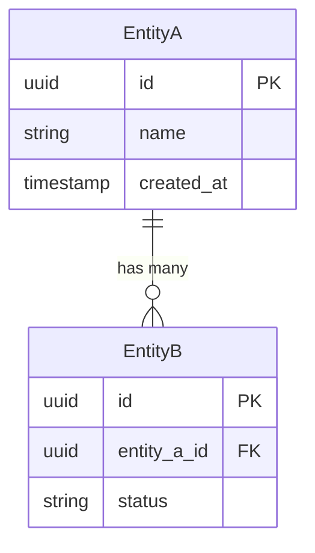

## 11. API Specifications

### [Endpoint Name]

- **Method & Path**: `POST /api/v1/[resource]`
- **Purpose**: [What it does]
- **Auth**: [Scheme, required scopes/roles]

**Request Body:**
```json
{
  "field": "type (constraints)"
}
```

**Response (200):**
```json
{
  "field": "type"
}
```

**Errors:**
| Code | Message | Remediation |
|------|---------|-------------|
| 400 | [Error] | [How to fix] |
| 401 | [Error] | [How to fix] |

---

## 12. Data Model

### Entity Relationship Diagram



### Entity Details

| Entity | Attribute | Type | Constraints | Notes |
|--------|-----------|------|-------------|-------|
| [Name] | [attr] | [type] | [PK/FK/index] | [PII?] |

### Data Lifecycle

- **Retention**: [Policy]
- **Deletion**: [Soft/hard delete approach]
- **Archival**: [Strategy]

---

## 13. Security Considerations

### Authentication & Authorization

| Role | Permissions | Access Level |
|------|-------------|--------------|
| [Role] | [What they can do] | [Scope] |

### Data Protection

- **In Transit**: [TLS version, etc.]
- **At Rest**: [Encryption approach]
- **Secrets Management**: [Approach]

### OWASP Top 10 Mapping

| Threat | Mitigation |
|--------|------------|
| Injection | [Approach] |
| Broken Auth | [Approach] |
| [Relevant threats...] | [Approach] |

---

## 14. Performance & Scalability

### SLOs/SLIs

| Metric | Target | Measurement |
|--------|--------|-------------|
| Latency (p95) | [target] | [how measured] |
| Availability | [target] | [how measured] |
| Throughput | [target] | [how measured] |

### Scaling Strategy

- **Horizontal**: [Approach]
- **Vertical**: [Limits]
- **Caching**: [Strategy, TTL, invalidation]
- **Rate Limiting**: [Approach]
