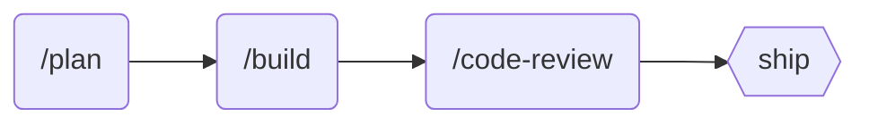

# Majestic Rails

Ruby on Rails development tools. Includes 22 specialized agents, 5 commands, and 9 skills.

## Installation

```bash
claude /plugin install majestic-rails
```

## Recommended Workflow



| Step | Tool | Purpose |
|------|------|---------|
| 1 | `/majestic-rails:workflows:plan` | Research and create plan |
| 2 | Choose next step | Build, review, backlog, or refine |
| 3 | `/majestic-rails:workflows:build` | Implement the plan |
| 4 | `/majestic-rails:workflows:review` | Smart multi-agent code review |

## Quick Reference

| I want to... | Use this |
|--------------|----------|
| Plan a new feature | `/majestic-rails:workflows:plan "feature"` |
| Build from a plan | `/majestic-rails:workflows:build docs/plans/feature.md` |
| Review code changes | `/majestic-rails:workflows:review` |
| Debug Rails issues | `agent rails-debugger` |
| Fix Rubocop violations | `agent rubocop-fixer` |
| Optimize database queries | `agent database-optimizer` |
| Build Hotwire components | `agent frontend:hotwire-coder` |
| Research a gem | `agent research:gem-research` |
| DHH-style code review | `agent review:dhh-code-reviewer` |

## Agents

Invoke with: `agent majestic-rails:<name>` or `agent majestic-rails:<category>:<name>`

### admin

| Agent | Description |
|-------|-------------|
| `admin:avo-coder` | Build Avo admin interfaces (fetches latest docs dynamically) |

### core

| Agent | Description |
|-------|-------------|
| `action-mailer-coder` | Create emails with parameterized mailers, previews, and background delivery |
| `action-policy-coder` | Authorization with ActionPolicy - policies, scopes, caching, GraphQL integration |
| `active-job-coder` | Create background jobs with Rails 8 conventions, Solid Queue patterns, and retry strategies |
| `database-admin` | Database operations, backups, monitoring, connection pooling for PostgreSQL/SQLite |
| `database-optimizer` | Advanced query optimization, EXPLAIN analysis, complex SQL for PostgreSQL/SQLite |
| `graphql-architect` | Design GraphQL schemas, resolvers, subscriptions using graphql-ruby patterns |
| `lint` | Run rubocop, erblint, and brakeman before pushing |
| `rails-debugger` | Debug Rails issues and validate bug reports by analyzing errors and reproducing issues |
| `rails-refactorer` | Refactor Rails code following conventions, Sandi Metz rules, and idiomatic Ruby patterns |
| `rubocop-fixer` | Fix Rubocop violations following project conventions |
| `solid-cache-coder` | Configure Solid Cache for database-backed caching (Rails 8 default) |
| `solid-queue-coder` | Configure Solid Queue for database-backed job processing (Rails 8 default) |

### frontend

| Agent | Description |
|-------|-------------|
| `frontend:hotwire-coder` | Build Turbo Drive, Frames, Streams with morphing, broadcasts, and real-time patterns |
| `frontend:stimulus-coder` | Create Stimulus controllers with targets, values, actions, and Turbo integration |
| `frontend:tailwind-coder` | Apply Tailwind CSS styling with responsive design patterns |

### research

| Agent | Description |
|-------|-------------|
| `research:gem-research` | Ruby gem evaluation, quality assessment, and implementation guidance |

### review

| Agent | Description |
|-------|-------------|
| `review:data-integrity-reviewer` | Review migrations, data constraints, transactions, and privacy compliance |
| `review:dhh-code-reviewer` | Review code following DHH's 37signals/Rails conventions |
| `review:performance-reviewer` | Analyze code for performance issues, query optimization, and scalability |
| `review:pragmatic-rails-reviewer` | Review code for quality, regressions, testability with pragmatic taste |
| `review:simplicity-reviewer` | Simplify code, detect anti-patterns, find duplication, enforce YAGNI |

## Commands

Invoke with: `/majestic-rails:<category>:<name>`

### gemfile

| Command | Description |
|---------|-------------|
| `gemfile:organize` | Organize Gemfile with categorized sections and alphabetized gems |
| `gemfile:upgrade` | Upgrade a gem safely with changelog review and testing |

### workflows

| Command | Description |
|---------|-------------|
| `workflows:build` | Execute work plans efficiently - build features following Rails conventions |
| `workflows:plan` | Transform feature descriptions into well-structured Rails project plans |
| `workflows:review` | Comprehensive code review using smart agent selection based on changed files |

## Skills

Invoke with: `skill majestic-rails:<name>`

| Skill | Description |
|-------|-------------|
| `business-logic-coder` | Implement business logic with ActiveInteraction and AASM state machines |
| `dhh-coder` | Code following DHH's standards for Rails elegance and simplicity |
| `gem-builder` | Comprehensive guide for building production-quality Ruby gems |
| `inertia-coder` | Build modern SPAs with Inertia.js + Rails using React, Vue, or Svelte |
| `minitest-coder` | Write Minitest tests covering both traditional and spec styles |
| `rspec-coder` | Write comprehensive RSpec tests with proper describe/context organization |
| `ruby-coder` | Write Ruby code following Ruby 3.x syntax and Sandi Metz's 4 Rules |
| `store-model-coder` | Wrap JSON-backed database columns with ActiveModel-like classes using store_model |
| `viewcomponent-coder` | Build component-based UIs with ViewComponent, slots, variants, and Lookbook |

## Usage Examples

```bash
# Plan a feature (with post-generation options: build, review, backlog, simplify, rework)
/majestic-rails:workflows:plan "Add user authentication with OAuth"

# Build from a plan
/majestic-rails:workflows:build docs/plans/add-user-authentication.md

# Comprehensive code review (smart agent selection)
/majestic-rails:workflows:review              # Review current branch vs main
/majestic-rails:workflows:review #123         # Review PR #123
/majestic-rails:workflows:review --staged     # Review staged changes
/majestic-rails:workflows:review app/models/  # Review specific files

# Gemfile management
/majestic-rails:gemfile:organize              # Organize Gemfile with categories
/majestic-rails:gemfile:upgrade rails         # Upgrade a specific gem
/majestic-rails:gemfile:upgrade --outdated    # Review all outdated gems

# Refactor Rails code
agent majestic-rails:rails-refactorer "Refactor the User model to follow Sandi Metz rules"

# Debug an issue
agent majestic-rails:rails-debugger "Investigate why user registration is failing"

# Fix Rubocop violations
agent majestic-rails:rubocop-fixer "Fix all Style cops in app/models/"

# Create background jobs
agent majestic-rails:active-job-coder "Create a job to process uploaded files"

# Create emails
agent majestic-rails:action-mailer-coder "Create a welcome email with parameterized mailer"

# Optimize database queries
agent majestic-rails:database-optimizer "Analyze slow query with EXPLAIN and recommend indexes"

# Design GraphQL API
agent majestic-rails:graphql-architect "Design schema for user posts with N+1 prevention"

# Build Hotwire components
agent majestic-rails:frontend:hotwire-coder "Create a live search with Turbo Frames"

# Create Stimulus controllers
agent majestic-rails:frontend:stimulus-coder "Create a dropdown controller with keyboard navigation"

# Style with Tailwind
agent majestic-rails:frontend:tailwind-coder "Style the user profile page"

# Build Avo admin
agent majestic-rails:admin:avo-coder "Create an Avo resource for the Product model"

# Research a gem
agent majestic-rails:research:gem-research "Evaluate devise vs rodauth for authentication"

# DHH-style code review
agent majestic-rails:review:dhh-code-reviewer "Review my controller for Rails best practices"

# Performance review
agent majestic-rails:review:performance-reviewer "Check for N+1 queries and scalability issues"

# Simplicity review
agent majestic-rails:review:simplicity-reviewer "Simplify this implementation"
```
